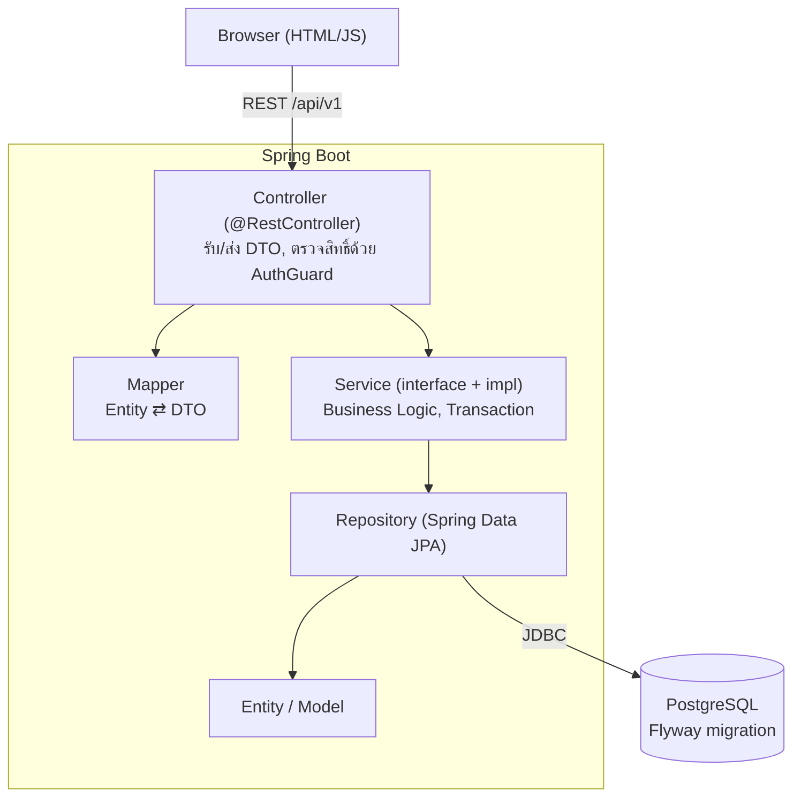
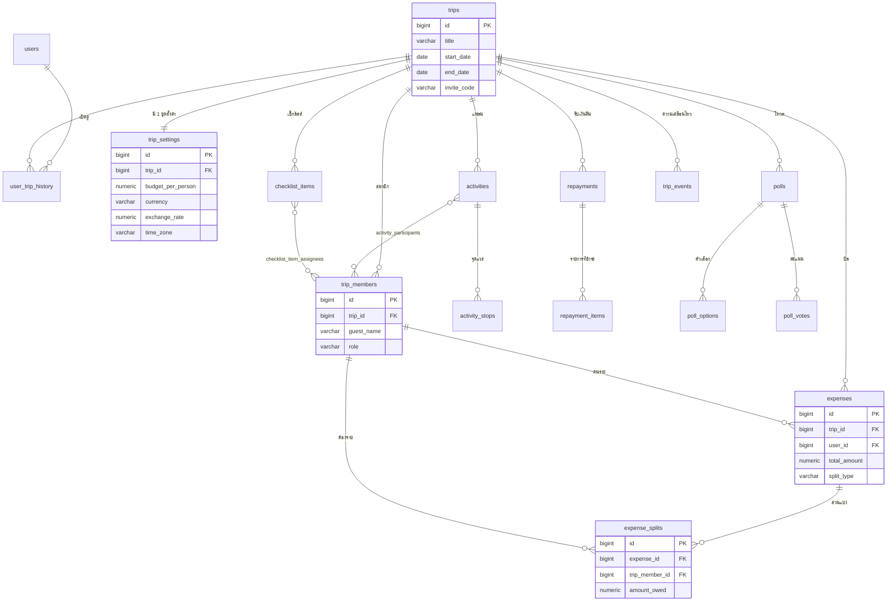

# Trip Expense Splitter
โปรเจกต์ของรายวิชา CP353002 Principles of Software Design and Development

ระบบวางแผนทริปและหารค่าใช้จ่ายสำหรับกลุ่มเพื่อน สร้างทริปแล้วชวนเพื่อนเข้าร่วมด้วยรหัสเชิญ
วางแผนกิจกรรมรายวัน (เดินทาง ที่พัก อาหาร กิจกรรม) บันทึกบิลแล้วหารได้ทั้งแบบเท่ากันและกำหนดยอดเอง
ระบบรวบยอดให้ว่าใครต้องโอนให้ใคร รองรับสกุลเงินต่างประเทศ
มีโหวตตัดสินใจร่วมกัน เช็กลิสต์สิ่งของพร้อมมอบหมายผู้รับผิดชอบ และประวัติความเคลื่อนไหวของทริป


| ลิงก์ | URL |
|---|---|
| ใช้งานจริง | https://trip-spitter.onrender.com/home.html |
| Swagger UI | https://trip-spitter.onrender.com/swagger-ui.html |

> แอปรันบนแผนฟรีของ Render ถ้าไม่มีคนใช้นาน ~15 นาทีจะหลับ การเปิดครั้งแรกอาจรอ 30-60 วินาที

## สมาชิกกลุ่ม

- **ชื่อ-นามสกุล :** นางสาวอาทิตยา โคตรธิสาร
- **รหัสนักศึกษา :** 643021259-2
- **Section :** 1
- **Branch :** `artitaya_6430212592_01` & `artitaya`
- **หน้าที่รับผิดชอบ :**
  - ระบบ: Backend (Spring Boot, REST API)
  - ออกแบบฐานข้อมูลและ Flyway, Frontend, Unit/API Test, Docker, CI/CD และ Deploy

## Tech Stack

| ส่วน | เทคโนโลยี |
|---|---|
| Backend | Spring Boot 4.1.1, Java 25, Maven (Maven Wrapper) |
| ORM / Database | Spring Data JPA (Hibernate), PostgreSQL, Flyway (migration) |
| Validation / Error | Jakarta Bean Validation, `@RestControllerAdvice` |
| API Docs | springdoc-openapi 3.1.1 (Swagger UI) |
| Frontend | HTML + CSS + JavaScript (เสิร์ฟจาก Spring Boot ที่ `code/src/main/resources/static`) |
| Testing | JUnit 5, Mockito, Spring Boot Test, ชุดทดสอบ API (Python) |
| DevOps | Docker, Docker Compose, GitHub Actions, Render (แอป), Neon (PostgreSQL) |

## System Architecture

แยก Layer ชัดเจน Controller ไม่เรียก Repository ตรง ทุกอย่างผ่าน Service



| แพ็กเกจ (`com.cp.party_trip`) | หน้าที่ |
|---|---|
| `controller` | REST Controller รับ request ส่ง response เป็น DTO |
| `dto/request`, `dto/response` | รูปแบบข้อมูลของ API (แยกจาก Entity) พร้อม Bean Validation |
| `mapper` | แปลง Entity ⇄ DTO |
| `service`, `service/impl` | Interface และ Business Logic |
| `service/split` | Strategy การหารบิล (`EqualSplitStrategy`, `CustomSplitStrategy`, `SplitStrategyFactory`) |
| `event` | Observer: เหตุการณ์ของทริปและ `TripEventListener` |
| `repository` | Spring Data JPA |
| `model` | Entity |
| `config` | `AuthGuard`, `AuthInterceptor`, `ApiErrorHandler`, CORS, OpenAPI |
| `common` | ยูทิลิตี้ (เงิน/สกุลเงิน) |

### การยืนยันตัวตน

ไม่มีรหัสผ่าน ใช้ชื่อเล่น + token ต่อเครื่อง: `POST /api/v1/sessions?username=...` ได้ token กลับมา
ส่งในหัว `X-Auth-Token` ในทุก request ถัดไป ตั้ง PIN เพื่อเข้าจากเครื่องอื่นได้ และมีรหัสกู้คืนที่คนสร้างทริปออกให้เพื่อน

## Database Design (ER Diagram)

มี 18 ตารางของระบบ (ไม่นับ `flyway_schema_history`) ความสัมพันธ์หลัก:

- **One-to-One:** `trips` ↔ `trip_settings` (งบ สกุลเงิน เรท เขตเวลา) FK `trip_id` เป็น UNIQUE
- **One-to-Many:** `trips` → `trip_members`, `activities`, `expenses`, `polls`, `checklist_items`, `repayments`, `trip_events`
- **Many-to-Many:** `activities` ↔ `trip_members` (`activity_participants`) และ `checklist_items` ↔ `trip_members` (`checklist_item_assignees`)



ทุกความสัมพันธ์มี Foreign Key constraint จริงในฐานข้อมูล (รวม 34 ตัว) เลือก `ON DELETE` ตามความหมายของข้อมูล:
`CASCADE` กับข้อมูลลูกที่ไม่มีแม่แล้วไม่มีความหมาย (ตัวเลือก/คะแนนโหวต), `SET NULL` กับ "ใครทำ" (ผู้สร้างโหวต/กิจกรรม),
และค่าเริ่มต้น (ห้ามลบ) กับข้อมูลเงิน (บิล, ส่วนแบ่ง, การรับเงินคืน)

ฐานข้อมูลสร้างและเปลี่ยนแปลงด้วย Flyway ที่ `code/src/main/resources/db/migration/`
(`V1` schema ตั้งต้น, `V2` trip_settings + ตารางกลาง + Index, `V3` trip_events, `V4` Foreign Key ที่เหลือ, `V5` ลบ UNIQUE ซ้ำของ poll_votes)
เอกสารเชิงลึก: [Data Dictionary + ER Diagram เต็ม](doc/data-dictionary.md) (ทุกตาราง ทุกคอลัมน์ คีย์ และ Index)

### เอกสารประกอบ (โฟลเดอร์ `doc/`)

| เอกสาร | เนื้อหา |
|---|---|
| [doc/solid-analysis.md](doc/solid-analysis.md) | หลัก SOLID แต่ละข้อปรากฏที่ไฟล์ไหน บรรทัดไหน |
| [doc/design-patterns.md](doc/design-patterns.md) | Design Pattern ที่ใช้ ปัญหาที่แก้ และ Class Diagram |
| [doc/data-dictionary.md](doc/data-dictionary.md) | พจนานุกรมข้อมูลและ ER Diagram |
| [doc/diagrams/](doc/diagrams/README.md) | Use Case, Domain Model, Class, Sequence, Activity, Component, Deployment, State |
| [doc/test-report.md](doc/test-report.md) | ผลการทดสอบ Unit Test และ API Test |
| [doc/user-manual.md](doc/user-manual.md) | คู่มือการใช้งานพร้อมภาพหน้าจอ |
| [doc/slide/trip-expense-splitter-slides.pdf](doc/slide/trip-expense-splitter-slides.pdf) | สไลด์นำเสนอโปรเจค (13 หน้า) |

## Installation & Setup

ต้องมี: **JDK 25**, **PostgreSQL 17 ขึ้นไป** (ทดสอบกับ 17 และ 18) หรือใช้ Docker แทนฐานข้อมูล ไม่ต้องติดตั้ง Maven (ใช้ `./mvnw`)

1. โคลนโปรเจกต์
   ```bash
   git clone https://github.com/txark/Trip_Spitter.git
   cd Trip_Spitter
   ```
2. สร้างฐานข้อมูลชื่อ `Trip_Spitter` ใน PostgreSQL
3. คัดลอก `.env.example` เป็น `.env` แล้วใส่ค่าของเครื่องตัวเอง (ไฟล์ `.env` ไม่ขึ้น git)
   ```properties
   DB_URL=jdbc:postgresql://localhost:5432/Trip_Spitter
   DB_USERNAME=postgres
   DB_PASSWORD=รหัสผ่านของคุณ
   ```

ตารางทั้งหมดสร้างให้เองด้วย Flyway ตอนเปิดแอปครั้งแรก

## How to Run

**วิธี A: Maven**
```bash
cd code
./mvnw spring-boot:run
```

**วิธี B: Docker Compose** (รวมฐานข้อมูลให้ ใส่แค่ `DB_PASSWORD` ใน `.env`)
```bash
docker compose up --build
```

เปิด http://localhost:8090/home.html (Swagger: http://localhost:8090/swagger-ui.html)

พอร์ตตั้งผ่านตัวแปร `PORT` ได้ (ค่าเริ่มต้น 8090)

## API Documentation

เอกสารแบบโต้ตอบ: **`/swagger-ui.html`** (JSON: `/v3/api-docs`) กดปุ่ม **Authorize** ใส่ token ที่ได้จาก login

Endpoint ตั้งชื่อแบบ Resource-based (ชื่อเป็นคำนามพหูพจน์ ซ้อนตามความเป็นเจ้าของ ใช้ HTTP method บอกการกระทำ) ทุกตัวอยู่ใต้ `/api/v1`

| Resource | Endpoint ตัวอย่าง |
|---|---|
| Sessions / Users | `POST /sessions` (เข้าสู่ระบบ), `GET /users/me`, `PUT /users/me/pin`, `PUT /users/me/username` |
| Trips | `POST /trips` (201), `GET /trips/{id}`, `PUT /trips/{id}/budget`, `PUT /trips/{id}/dates` |
| Invitations | `POST /invitations/{inviteCode}/members` (เข้าร่วมทริปด้วยรหัสเชิญ) |
| Members | `GET /trips/{id}/members`, `POST /trips/{id}/members/{memberId}/recovery-codes` |
| Expenses | `GET /trips/{id}/expenses`, `GET /trips/{id}/expenses/page?page=&size=&sort=` (แบ่งหน้า), `POST /trips/{id}/expenses` (201), `PUT /expenses/{id}`, `DELETE /expenses/{id}` (204), `PUT /expenses/{id}/splits/{memberId}/paid` |
| Repayments | `POST /trips/{id}/repayments` (201), `DELETE /repayments/{id}` (204) |
| Debts | `GET /trips/{id}/debt-transfers`, `GET /trips/{id}/members/{memberId}/debt-summary` |
| Activities | `GET /trips/{id}/activities`, `POST /trips/{id}/activities` (201), `PUT /activities/{id}`, `DELETE /activities/{id}` |
| Checklist items | `GET /trips/{id}/checklist-items`, `POST /trips/{id}/checklist-items/bulk`, `PATCH /checklist-items/{id}`, `PUT /checklist-items/{id}/assignees`, `DELETE /checklist-items/{id}` |
| Polls | `GET /trips/{id}/polls`, `POST /polls` (201), `POST /polls/{id}/votes`, `GET /polls/{id}/results`, `PUT /polls/{id}/closed`, `DELETE /polls/{id}` |
| Trip history | `GET /users/{userId}/trip-history`, `PUT /users/{userId}/trip-history/{tripId}` |
| Trip events | `GET /trips/{id}/events` (ความเคลื่อนไหวล่าสุด) |

รายการครบทุก endpoint (46 รายการ) ดูที่ Swagger UI

รูปแบบ error เป็น JSON เดียวกันทุก endpoint: `{"message": "..."}` พร้อม HTTP status
(400 ข้อมูลไม่ถูกต้อง / 401 ยังไม่ได้เข้าสู่ระบบ / 403 ไม่ใช่สมาชิกทริป / 404 ไม่พบ / 409 ข้อมูลชนกัน)

## How to Run Tests

**Unit test** (JUnit 5 + Mockito + Spring Boot Test) ต้องมีฐานข้อมูลที่ตั้งค่าใน `.env` (ใช้โหลด context):
```bash
cd code
./mvnw test
```

**API test** ยิง API จริงของ backend ที่เปิดอยู่ (ใช้ Python 3 ไม่ต้องติดตั้งแพ็กเกจ):
```bash
python test/api-tests/run_all.py
```
ครอบคลุมสิทธิ์/การยืนยันตัวตน, การใช้งานพร้อมกัน, ความสัมพันธ์ของฐานข้อมูล, Strategy/Observer/แบ่งหน้า/Swagger
รายละเอียดดู [`test/api-tests/README.md`](test/api-tests/README.md)

CI (GitHub Actions) รัน build + unit test + build Docker image ทุกครั้งที่ push และเปิด PR

## Deployment URL

- **เว็บ:** https://trip-spitter.onrender.com/home.html
- **Swagger UI:** https://trip-spitter.onrender.com/swagger-ui.html
- **Hosting:** Render (Docker, แผนฟรี) ฐานข้อมูล Neon PostgreSQL ตั้งค่าใน `render.yaml`
  ตัวแปรลับ (`DB_URL`, `DB_USERNAME`, `DB_PASSWORD`) ตั้งในหน้า Environment ของ Render ไม่เก็บใน git

## คู่มือการใช้งาน

คู่มือแบบมีภาพหน้าจอจริงทุกหน้า อยู่ที่ **[doc/user-manual.md](doc/user-manual.md)**

| ขั้นตอน | หัวข้อ |
|---|---|
| 1 | [หน้าแรก: เข้าระบบ สร้างห้อง เข้าร่วมห้อง](doc/user-manual.md#1-หน้าแรก-เข้าระบบ-สร้างห้อง-เข้าร่วมห้อง) |
| 2 | [ภาพรวมทริป](doc/user-manual.md#2-ภาพรวมทริป) |
| 3 | [แพลนเที่ยว](doc/user-manual.md#3-แพลนเที่ยว) |
| 4 | [ค่าใช้จ่าย](doc/user-manual.md#4-ค่าใช้จ่าย) |
| 5 | [สรุปยอดคืน (ยืนยันรับเงิน รับเงินยอดรวม ยกเลิก)](doc/user-manual.md#5-สรุปยอดคืน) |
| 6 | [แชร์สรุปทริป](doc/user-manual.md#6-แชร์สรุปทริป) |
| 7 | [โหวต](doc/user-manual.md#7-โหวต) |
| 8 | [เช็คลิสต์](doc/user-manual.md#8-เช็คลิสต์) |

## Project Structure

โครงโฟลเดอร์ตามใบงาน (`code/`, `test/`, `doc/`, `img/`):

```
.
├── code/                          # ซอร์สโค้ดและการตั้งค่า (Maven project)
│   ├── pom.xml, mvnw, .mvn/
│   ├── src/main/java/com/cp/party_trip/
│   │   ├── controller/            # REST Controller
│   │   ├── service/               # Interface (+ impl/, split/ = Strategy)
│   │   ├── repository/            # Spring Data JPA
│   │   ├── model/                 # Entity
│   │   ├── dto/{request,response}/
│   │   ├── mapper/
│   │   ├── event/                 # Observer
│   │   ├── config/                # AuthGuard, ErrorHandler, OpenAPI, CORS
│   │   └── common/
│   └── src/main/resources/
│       ├── db/migration/          # Flyway V1-V5
│       ├── static/                # หน้าเว็บ (home, dashboard, plan, expenses, debts, polls, checklist)
│       └── application.properties
├── test/                          # การทดสอบทั้งหมด
│   ├── java/                      # Unit test (JUnit 5 + Mockito)
│   └── api-tests/                 # ชุดทดสอบ API (Python)
├── doc/                           # เอกสาร: คู่มือการใช้งาน, SOLID, design patterns, data dictionary, test report, สไลด์ (slide/), diagrams/
├── img/                           # รูปภาพและมัลติมีเดีย
├── Dockerfile, docker-compose.yml, render.yaml, .env.example
└── .github/workflows/ci.yml
```

Dockerfile, docker-compose.yml และ render.yaml อยู่ที่รากของ repository (Docker build context เป็นราก) ส่วนคำสั่ง Maven ให้รันในโฟลเดอร์ `code/`
