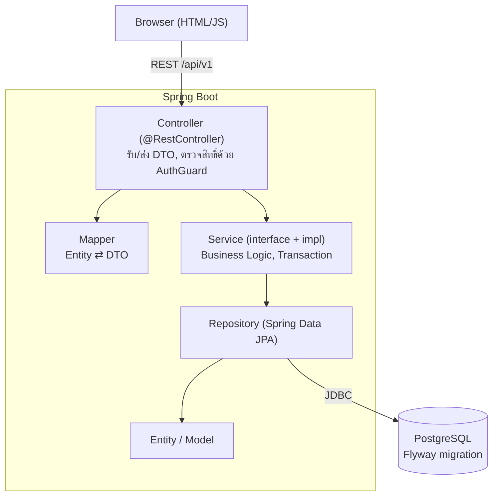

# Trip Expense Splitter
โปรเจกต์ของรายวิชา CP353002 Principles of Software Design and Development (Spring Boot)

ระบบวางแผนทริปและหารค่าใช้จ่ายสำหรับกลุ่มเพื่อน สร้างทริปแล้วชวนเพื่อนเข้าร่วมด้วยรหัสเชิญ
วางแผนกิจกรรมรายวัน (เดินทาง ที่พัก อาหาร กิจกรรม) บันทึกบิลแล้วหารได้ทั้งแบบเท่ากันและกำหนดยอดเอง
ระบบรวบยอดให้ว่าใครต้องโอนให้ใครน้อยที่สุด รองรับสกุลเงินต่างประเทศ
มีโหวตตัดสินใจร่วมกัน เช็กลิสต์สิ่งของพร้อมมอบหมายผู้รับผิดชอบ และประวัติความเคลื่อนไหวของทริป


| ลิงก์ | URL |
|---|---|
| ใช้งานจริง | https://trip-spitter.onrender.com/home.html |
| Swagger UI | https://trip-spitter.onrender.com/swagger-ui.html |

> แอปรันบนแผนฟรีของ Render ถ้าไม่มีคนใช้นาน ~15 นาทีจะหลับ การเปิดครั้งแรกอาจรอ 30-60 วินาที

## สมาชิกกลุ่ม

- **ชื่อ-นามสกุล :** นางสาวอาทิตยา โคตรธิสาร
- **รหัสนักศึกษา :** 643021259-2
- **Section :** 1
- **Branch :** `artitaya_6430212592_01` & `artitaya`
- **หน้าที่รับผิดชอบ :**
  - ระบบ: Backend (Spring Boot, REST API)
  - ออกแบบฐานข้อมูลและ Flyway, Frontend, Unit/API Test, Docker, CI/CD และ Deploy

## Tech Stack

| ส่วน | เทคโนโลยี |
|---|---|
| Backend | Spring Boot 4.1.1, Java 25, Maven (Maven Wrapper) |
| ORM / Database | Spring Data JPA (Hibernate), PostgreSQL, Flyway (migration) |
| Validation / Error | Jakarta Bean Validation, `@RestControllerAdvice` |
| API Docs | springdoc-openapi 3.1.1 (Swagger UI) |
| Frontend | HTML + CSS + JavaScript (เสิร์ฟจาก Spring Boot ที่ `code/src/main/resources/static`) |
| Testing | JUnit 5, Mockito, Spring Boot Test, ชุดทดสอบ API (Python) |
| DevOps | Docker, Docker Compose, GitHub Actions, Render (แอป), Neon (PostgreSQL) |

## System Architecture

แยก Layer ชัดเจน Controller ไม่เรียก Repository ตรง ทุกอย่างผ่าน Service



| แพ็กเกจ (`com.cp.party_trip`) | หน้าที่ |
|---|---|
| `controller` | REST Controller รับ request ส่ง response เป็น DTO |
| `dto/request`, `dto/response` | รูปแบบข้อมูลของ API (แยกจาก Entity) พร้อม Bean Validation |
| `mapper` | แปลง Entity ⇄ DTO |
| `service`, `service/impl` | Interface และ Business Logic |
| `service/split` | Strategy การหารบิล (`EqualSplitStrategy`, `CustomSplitStrategy`, `SplitStrategyFactory`) |
| `event` | Observer: เหตุการณ์ของทริปและ `TripEventListener` |
| `repository` | Spring Data JPA |
| `model` | Entity |
| `config` | `AuthGuard`, `AuthInterceptor`, `ApiErrorHandler`, CORS, OpenAPI |
| `common` | ยูทิลิตี้ (เงิน/สกุลเงิน) |

### การยืนยันตัวตน

ไม่มีรหัสผ่าน ใช้ชื่อเล่น + token ต่อเครื่อง: `POST /api/v1/users/login?username=...` ได้ token กลับมา
ส่งในหัว `X-Auth-Token` ในทุก request ถัดไป ตั้ง PIN เพื่อเข้าจากเครื่องอื่นได้ และมีรหัสกู้คืนที่คนสร้างทริปออกให้เพื่อน

## Database Design (ER Diagram)

มี 18 ตารางของระบบ (ไม่นับ `flyway_schema_history`) ความสัมพันธ์หลัก:

- **One-to-One:** `trips` ↔ `trip_settings` (งบ สกุลเงิน เรท เขตเวลา) FK `trip_id` เป็น UNIQUE
- **One-to-Many:** `trips` → `trip_members`, `activities`, `expenses`, `polls`, `checklist_items`, `repayments`, `trip_events`
- **Many-to-Many:** `activities` ↔ `trip_members` (`activity_participants`) และ `checklist_items` ↔ `trip_members` (`checklist_item_assignees`)


ทุกความสัมพันธ์มี Foreign Key constraint จริงในฐานข้อมูล (รวม 34 ตัว) เลือก `ON DELETE` ตามความหมายของข้อมูล:
`CASCADE` กับข้อมูลลูกที่ไม่มีแม่แล้วไม่มีความหมาย (ตัวเลือก/คะแนนโหวต), `SET NULL` กับ "ใครทำ" (ผู้สร้างโหวต/กิจกรรม),
และค่าเริ่มต้น (ห้ามลบ) กับข้อมูลเงิน (บิล, ส่วนแบ่ง, การรับเงินคืน)

ฐานข้อมูลสร้างและเปลี่ยนแปลงด้วย Flyway ที่ `code/src/main/resources/db/migration/`
(`V1` schema ตั้งต้น, `V2` trip_settings + ตารางกลาง + Index, `V3` trip_events, `V4` Foreign Key ที่เหลือ, `V5` ลบ UNIQUE ซ้ำของ poll_votes)
เอกสารเชิงลึก: [Data Dictionary + ER Diagram เต็ม](doc/data-dictionary.md) (ทุกตาราง ทุกคอลัมน์ คีย์ และ Index)

### เอกสารประกอบ (โฟลเดอร์ `doc/`)

| เอกสาร | เนื้อหา |
|---|---|
| [doc/solid-analysis.md](doc/solid-analysis.md) | หลัก SOLID แต่ละข้อปรากฏที่ไฟล์ไหน บรรทัดไหน |
| [doc/design-patterns.md](doc/design-patterns.md) | Design Pattern ที่ใช้ ปัญหาที่แก้ และ Class Diagram |
| [doc/data-dictionary.md](doc/data-dictionary.md) | พจนานุกรมข้อมูลและ ER Diagram |
| [doc/diagrams/](doc/diagrams/README.md) | Use Case, Domain Model, Class, Sequence, Activity, Component, Deployment, State |
| [doc/test-report.md](doc/test-report.md) | ผลการทดสอบ Unit Test และ API Test |

## Installation & Setup

ต้องมี: **JDK 25**, **PostgreSQL 17 ขึ้นไป** (ทดสอบกับ 17 และ 18) หรือใช้ Docker แทนฐานข้อมูล ไม่ต้องติดตั้ง Maven (ใช้ `./mvnw`)

1. โคลนโปรเจกต์
   ```bash
   git clone https://github.com/txark/Trip_Spitter.git
   cd Trip_Spitter
   ```
2. สร้างฐานข้อมูลชื่อ `Trip_Spitter` ใน PostgreSQL
3. คัดลอก `.env.example` เป็น `.env` แล้วใส่ค่าของเครื่องตัวเอง (ไฟล์ `.env` ไม่ขึ้น git)
   ```properties
   DB_URL=jdbc:postgresql://localhost:5432/Trip_Spitter
   DB_USERNAME=postgres
   DB_PASSWORD=รหัสผ่านของคุณ
   ```

ตารางทั้งหมดสร้างให้เองด้วย Flyway ตอนเปิดแอปครั้งแรก

## How to Run

**วิธี A: Maven**
```bash
cd code
./mvnw spring-boot:run
```

**วิธี B: Docker Compose** (รวมฐานข้อมูลให้ ใส่แค่ `DB_PASSWORD` ใน `.env`)
```bash
docker compose up --build
```

เปิด http://localhost:8090/home.html (Swagger: http://localhost:8090/swagger-ui.html)

พอร์ตตั้งผ่านตัวแปร `PORT` ได้ (ค่าเริ่มต้น 8090)

## API Documentation

เอกสารแบบโต้ตอบ: **`/swagger-ui.html`** (JSON: `/v3/api-docs`) กดปุ่ม **Authorize** ใส่ token ที่ได้จาก login

| กลุ่ม | Base path | ตัวอย่าง |
|---|---|---|
| Users | `/api/v1/users` | `POST /login`, `POST /pin`, `GET /me` |
| Trips | `/api/v1/trips` | `POST /create` (201), `POST /join/{code}`, `GET /{id}`, `PUT /{id}/budget` |
| Trip events | `/api/v1/trips/{id}/events` | `GET` ความเคลื่อนไหวล่าสุด |
| Expenses | `/api/v1/expenses` | `POST /add/{tripId}` (201), `PUT /{id}`, `DELETE /{id}` (204), `GET /trip/{id}/page?page=&size=&sort=` (แบ่งหน้า) |
| Debts | `/api/v1/debts` | `GET /simplify/{tripId}`, `GET /summary-details/{tripId}` |
| Activities | `/api/v1/activities` | `POST /add/{tripId}`, `GET /trip/{id}`, `DELETE /{id}` |
| Checklist | `/api/v1/checklist` | `GET /{tripId}`, `POST`, `POST /bulk`, `PUT /{id}/assignees` |
| Polls | `/api/v1/polls` | `POST`, `POST /{id}/vote`, `GET /{id}/results` |
| History | `/api/v1/history` | `GET /recent/{userId}` |

รูปแบบ error เป็น JSON เดียวกันทุก endpoint: `{"message": "..."}` พร้อม HTTP status
(400 ข้อมูลไม่ถูกต้อง / 401 ยังไม่ได้เข้าสู่ระบบ / 403 ไม่ใช่สมาชิกทริป / 404 ไม่พบ / 409 ข้อมูลชนกัน)

## How to Run Tests

**Unit test** (JUnit 5 + Mockito + Spring Boot Test) ต้องมีฐานข้อมูลที่ตั้งค่าใน `.env` (ใช้โหลด context):
```bash
cd code
./mvnw test
```

**API test** ยิง API จริงของ backend ที่เปิดอยู่ (ใช้ Python 3 ไม่ต้องติดตั้งแพ็กเกจ):
```bash
python test/api-tests/run_all.py
```
ครอบคลุมสิทธิ์/การยืนยันตัวตน, การใช้งานพร้อมกัน, ความสัมพันธ์ของฐานข้อมูล, Strategy/Observer/แบ่งหน้า/Swagger
รายละเอียดดู [`test/api-tests/README.md`](test/api-tests/README.md)

CI (GitHub Actions) รัน build + unit test + build Docker image ทุกครั้งที่ push และเปิด PR

## Deployment URL

- **เว็บ:** https://trip-spitter.onrender.com/home.html
- **Swagger UI:** https://trip-spitter.onrender.com/swagger-ui.html
- **Hosting:** Render (Docker, แผนฟรี) ฐานข้อมูล Neon PostgreSQL ตั้งค่าใน `render.yaml`
  ตัวแปรลับ (`DB_URL`, `DB_USERNAME`, `DB_PASSWORD`) ตั้งในหน้า Environment ของ Render ไม่เก็บใน git

## คู่มือการใช้งาน

เปิดใช้งานที่ https://trip-spitter.onrender.com/home.html ไม่ต้องสมัครสมาชิกด้วยอีเมล ใช้แค่ "ชื่อเล่น" (ตั้ง PIN เพิ่มได้เพื่อเข้าชื่อเดิมจากเครื่องอื่น)
ภาพด้านล่างเป็นหน้าจอจริงของระบบ

| ขั้นตอน | ทำอะไร | หน้า |
|---|---|---|
| 1 | เข้าระบบด้วยชื่อเล่น แล้วสร้างห้องทริปหรือเข้าร่วมด้วยรหัสเชิญ | [หน้าแรก](#1-หน้าแรก-เข้าระบบ-สร้างห้อง-เข้าร่วมห้อง) |
| 2 | ดูภาพรวมทริปและส่งรหัสเชิญให้เพื่อน | [ภาพรวมทริป](#2-ภาพรวมทริป) |
| 3 | วางแพลนเที่ยวรายวัน | [แพลนเที่ยว](#3-แพลนเที่ยว) |
| 4 | บันทึกค่าใช้จ่ายและเลือกวิธีหาร | [ค่าใช้จ่าย](#4-ค่าใช้จ่าย) |
| 5 | ดูว่าใครต้องคืนใคร แล้วบันทึกการรับเงิน | [สรุปยอดคืน](#5-สรุปยอดคืน) |
| 6 | ส่งสรุปทริปเข้ากลุ่มแชต | [แชร์สรุปทริป](#6-แชร์สรุปทริป) |
| 7 | ให้เพื่อนโหวตตัดสินใจ | [โหวต](#7-โหวต) |
| 8 | จดของที่ต้องเตรียมและแบ่งคนรับผิดชอบ | [เช็คลิสต์](#8-เช็คลิสต์) |

### 1. หน้าแรก: เข้าระบบ สร้างห้อง เข้าร่วมห้อง


1. เข้าครั้งแรกระบบตั้งชื่อชั่วคราวให้ (เช่น TripGuest_123) กดที่ชื่อมุมขวาบนเพื่อเปลี่ยนเป็นชื่อเล่นของคุณ (ชื่อนี้เพื่อนในทริปจะเห็น)
2. กด **สร้างห้องใหม่** หรือ **เข้าร่วมด้วยรหัสเชิญ**
3. ทริปที่เคยเข้าจะแสดงในรายการ **ทริปล่าสุดของคุณ** กดเพื่อกลับเข้าทริปได้ทันที

**สร้างห้องใหม่:** ใส่ชื่อห้อง วันออกเดินทาง และวันกลับ แล้วกด **ยืนยันสร้างห้อง** ระบบจะสร้างรหัสเชิญ 6 หลักให้


**เข้าร่วมด้วยรหัสเชิญ:** ใส่รหัส 6 หลักที่เพื่อนส่งให้ แล้วกด **เข้าร่วมห้องทริป** เพื่อนในห้องจะเห็นคุณด้วยชื่อเล่นของคุณ


**เปลี่ยนชื่อเล่น / ตั้ง PIN:** กดที่ชื่อมุมขวาบน ใส่ชื่อใหม่ และตั้ง PIN 4-6 หลักถ้าต้องการเข้าชื่อนี้จากเครื่องอื่น ชื่อใหม่จะตามไปทุกทริปและทุกบิลเดิมโดยอัตโนมัติ


> ลืม PIN หรือเปลี่ยนเครื่อง: ให้คนสร้างทริปออก **รหัสกู้คืน** ให้ (ใช้ได้ 30 นาที) แล้วใส่รหัสนั้นในช่อง PIN

### 2. ภาพรวมทริป


- บัตร **Boarding Pass** แสดงชื่อทริป วันเริ่ม-สิ้นสุด และเพื่อนร่วมทาง กด **คัดลอก** เพื่อส่งรหัสเชิญให้เพื่อน
- การ์ดสรุปแสดงค่าใช้จ่ายทั้งทริป ส่วนของคุณ และยอดสุทธิของคุณ
- ด้านล่างเป็นแพลนที่ใกล้ถึง ค่าใช้จ่ายล่าสุด เปรียบเทียบแผนกับที่จ่ายจริง และรายชื่อสมาชิก
- แถบด้านซ้ายใช้สลับไปหน้าต่างๆ ของทริป
- ถ้ายังไม่ตั้ง PIN จะมีแถบเตือน **ตั้ง PIN กันลืม** ที่ด้านบน กดตั้งหรือเลือก "ไว้ทีหลัง" ก็ได้

### 3. แพลนเที่ยว


1. เลือกประเภทกิจกรรม: เดินทาง, กิน, ที่พัก, เที่ยวชม, กิจกรรม หรืออื่นๆ
2. ถ้าเป็นการเดินทาง ให้เลือกวิธี (รถส่วนตัว รถตู้ รถไฟ เครื่องบิน เรือ ฯลฯ) และกรอกต้นทาง ปลายทาง เวลาออก เวลาถึง
3. เลือกวันที่ทำกิจกรรม เลือกคนที่ไปด้วย ใส่ค่าใช้จ่ายต่อคน (ประมาณการ) และโน้ต
4. กด **เพิ่มลงแพลน** กิจกรรมจะขึ้นในวันที่เลือกทางด้านขวา

แถบด้านบนแสดงนับถอยหลังวันเดินทาง จำนวนรายการ และงบรวมของคุณ

### 4. ค่าใช้จ่าย


1. ใส่จำนวนเงิน (เลือกสกุลเงินได้) และชื่อรายการ เช่น "ค่าอาหารกลางวัน"
2. เลือกวันที่จ่ายและหมวดหมู่ (อาหาร ที่พัก เดินทาง เที่ยวชม กิจกรรม ช้อปปิ้ง อื่นๆ)
3. เลือก **จ่ายโดย** (ใครสำรองจ่าย) และ **ผู้ร่วมหาร** (ใครต้องช่วยจ่าย)
4. เลือก **วิธีหาร**
   - **หารเท่ากัน:** ระบบหารให้เท่ากัน เศษสตางค์ปัดให้ลงตัว
   - **กำหนดเอง:** ระบุยอดของแต่ละคนเอง
5. กด **บันทึกบิล**

บิลที่บันทึกแล้วดูได้ 3 มุมมอง: **ฉันจ่าย**, **ฉันร่วมหาร** และ **ทั้งทริป** แก้ไขหรือลบได้เฉพาะคนที่จ่ายหรือคนที่บันทึกบิลนั้น และทำไม่ได้ถ้ามีเพื่อนจ่ายคืนบิลนั้นแล้ว

### 5. สรุปยอดคืน

หน้านี้บอกว่า "ฉันต้องจ่ายใคร" และ "ใครต้องคืนฉัน" ตัวเลขด้านบนคือ **ต้องจ่าย**, **รอรับคืน** และ **สุทธิ**


- ฝั่งซ้าย **รายการที่ต้องชำระ:** แสดงคนที่คุณต้องโอนให้ พอโอนแล้วให้แจ้งเจ้าของบิลกดยืนยัน
- ฝั่งขวา **บิลที่คุณสำรองจ่าย:** แสดงเพื่อนแต่ละคนที่ค้างคุณ แต่ละบรรทัดบอก "เหลือ ... จาก ..." (ยอดที่เหลือ จากยอดที่เขาต้องจ่ายเต็ม)

**ยืนยันรับเงินทีละบิล:** กด **ยืนยันรับเงิน** ที่บิลนั้น แล้วยืนยันในกล่องที่ขึ้นมา


**รับเงินเป็นยอดรวม (ไม่ระบุรายการ):** ใช้เมื่อเพื่อนโอนมาก้อนเดียวหลายบิล


1. กด **รับเงินเป็นยอดรวม** ที่การ์ดของเพื่อน ใส่ยอดที่ได้รับ (หรือกด **เต็มจำนวน**)
2. ติ๊กเลือกบิลที่จะหัก ระบบจะหักจาก **บิลที่ค้างน้อยที่สุดก่อน** เพื่อปิดบิลเล็กๆ ให้จบ ไม่ค้างเป็น "จ่ายบางส่วน" นาน ตัวอย่างการหักแสดงทางขวาของแต่ละบรรทัดทันที
3. กด **บันทึกรับเงิน**

รายการรับเงินยอดรวมถูกพับเก็บไว้ในแถบเดียว กดเพื่อขยายดูว่าแต่ละครั้งหักจากบิลไหนเท่าไร ถ้ากรอกผิดให้กดไอคอนถังขยะ (ยกเลิกได้เฉพาะรายการล่าสุดของเพื่อนคนนั้น และต้องเป็นคนที่รับเงิน) ยอดที่หักจะกลับไปค้างเหมือนเดิม

### 6. แชร์สรุปทริป

กด **แชร์สรุปทริป** (ในหน้าภาพรวมหรือสรุปยอดคืน) ระบบสร้างข้อความสรุปให้ส่งเข้ากลุ่มแชต


ในข้อความมี ค่าใช้จ่ายทั้งทริปและเฉลี่ยต่อคน ใครต้องคืนใคร เท่าไร ค่าใช้จ่ายของแต่ละคน (ทั้งหมด / เฉพาะตัวเอง) และค่าใช้จ่ายตามหมวด
ปุ่ม **คัดลอก** คัดลอกข้อความ **ส่งเข้า LINE** เปิด LINE พร้อมข้อความ และ **แชร์** ใช้เมนูแชร์ของเครื่อง (มือถือ)

### 7. โหวต


1. ใส่คำถาม (กดหัวข้อตัวอย่างเพื่อใช้ได้เลย เช่น "มื้อนี้กินอะไรดี?")
2. ใส่ตัวเลือกอย่างน้อย 2 ข้อ (สูงสุด 10 ข้อ กด **เพิ่มตัวเลือก**)
3. เลือกระยะเวลาเปิดโหวต: ไม่จำกัด, 30 นาที, 1 ชั่วโมง, 3 ชั่วโมง, 1 วัน หรือกำหนดเอง
4. กด **เปิดโหวต** เพื่อนกดเลือกตัวเลือกได้ทันที กดตัวเลือกเดิมซ้ำเพื่อยกเลิกคะแนน หรือกดตัวเลือกอื่นเพื่อเปลี่ยน คนสร้างโหวตปิดโหวตได้เอง

### 8. เช็คลิสต์


1. ใส่ชื่อสิ่งของ (เพิ่มหลายชิ้นพร้อมกันได้ด้วย **เพิ่มอีกชิ้น**) จำนวน หน่วย และโน้ต
2. เลือกหมวดหมู่ (อุปกรณ์, เสื้อผ้า, ยา, อาหาร/ขนม, เอกสาร, อื่นๆ)
3. เลือก **ผู้รับผิดชอบ** ได้หลายคน
4. กด **เพิ่มลงเช็คลิสต์** เมื่อเตรียมของแล้วให้ติ๊กในรายการ ตัวนับด้านบนจะแสดงว่าเตรียมแล้วกี่ชิ้น และมีของที่คุณต้องเอาไปกี่ชิ้น

## Project Structure

โครงโฟลเดอร์ตามใบงาน (`code/`, `test/`, `doc/`, `img/`):

```
.
├── code/                          # ซอร์สโค้ดและการตั้งค่า (Maven project)
│   ├── pom.xml, mvnw, .mvn/
│   ├── src/main/java/com/cp/party_trip/
│   │   ├── controller/            # REST Controller
│   │   ├── service/               # Interface (+ impl/, split/ = Strategy)
│   │   ├── repository/            # Spring Data JPA
│   │   ├── model/                 # Entity
│   │   ├── dto/{request,response}/
│   │   ├── mapper/
│   │   ├── event/                 # Observer
│   │   ├── config/                # AuthGuard, ErrorHandler, OpenAPI, CORS
│   │   └── common/
│   └── src/main/resources/
│       ├── db/migration/          # Flyway V1-V5
│       ├── static/                # หน้าเว็บ (home, dashboard, plan, expenses, debts, polls, checklist)
│       └── application.properties
├── test/                          # การทดสอบทั้งหมด
│   ├── java/                      # Unit test (JUnit 5 + Mockito)
│   └── api-tests/                 # ชุดทดสอบ API (Python)
├── doc/                           # เอกสาร: SOLID, design patterns, data dictionary, test report, diagrams/
├── img/                           # รูปภาพและมัลติมีเดีย
├── Dockerfile, docker-compose.yml, render.yaml, .env.example
└── .github/workflows/ci.yml
```

Dockerfile, docker-compose.yml และ render.yaml อยู่ที่รากของ repository (Docker build context เป็นราก) ส่วนคำสั่ง Maven ให้รันในโฟลเดอร์ `code/`
