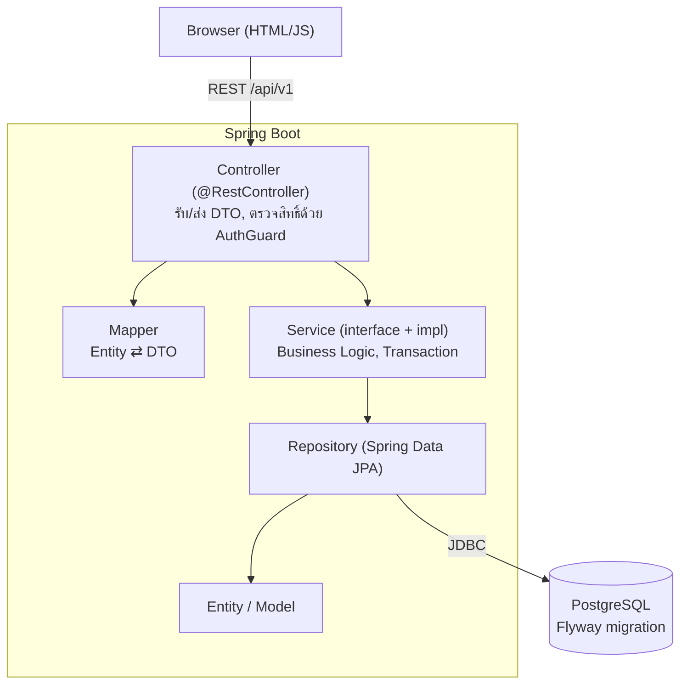

# Trip Expense Splitter

ระบบวางแผนทริปและหารค่าใช้จ่ายสำหรับกลุ่มเพื่อน สร้างทริปแล้วชวนเพื่อนเข้าร่วมด้วยรหัสเชิญ
วางแผนกิจกรรมรายวัน (เดินทาง ที่พัก อาหาร กิจกรรม) บันทึกบิลแล้วหารได้ทั้งแบบเท่ากันและกำหนดยอดเอง
ระบบรวบยอดให้ว่าใครต้องโอนให้ใครน้อยที่สุด รองรับสกุลเงินต่างประเทศ
มีโหวตตัดสินใจร่วมกัน เช็กลิสต์สิ่งของพร้อมมอบหมายผู้รับผิดชอบ และประวัติความเคลื่อนไหวของทริป

โปรเจกต์ของรายวิชา CP353002 Principles of Software Design and Development (Spring Boot)

| ลิงก์ | URL |
|---|---|
| ใช้งานจริง | https://trip-spitter.onrender.com/home.html |
| Swagger UI | https://trip-spitter.onrender.com/swagger-ui.html |

> แอปรันบนแผนฟรีของ Render ถ้าไม่มีคนใช้นาน ~15 นาทีจะหลับ การเปิดครั้งแรกอาจรอ 30-60 วินาที

## สมาชิกกลุ่ม

| ลำดับ | ชื่อ-นามสกุล | รหัสนักศึกษา | Section | Branch | หน้าที่รับผิดชอบ |
|---|---|---|---|---|---|
| 1 | นางสาวอาทิตยา โคตรธิสาร | 643021259-2 | 01 | `artitaya_6430212592_01` & `artitaya` | - ทำทั้งระบบ: Backend (Spring Boot, REST API)  - ออกแบบฐานข้อมูลและ Flyway, Frontend, Unit/API Test, Docker, CI/CD และ Deploy |

## Tech Stack

| ส่วน | เทคโนโลยี |
|---|---|
| Backend | Spring Boot 4.1.1, Java 25, Maven (Maven Wrapper) |
| ORM / Database | Spring Data JPA (Hibernate), PostgreSQL, Flyway (migration) |
| Validation / Error | Jakarta Bean Validation, `@RestControllerAdvice` |
| API Docs | springdoc-openapi 3.1.1 (Swagger UI) |
| Frontend | HTML + CSS + JavaScript (เสิร์ฟจาก Spring Boot ที่ `src/main/resources/static`) |
| Testing | JUnit 5, Mockito, Spring Boot Test, ชุดทดสอบ API (Python) |
| DevOps | Docker, Docker Compose, GitHub Actions, Render (แอป), Neon (PostgreSQL) |

## System Architecture

แยก Layer ชัดเจน Controller ไม่เรียก Repository ตรง ทุกอย่างผ่าน Service



| แพ็กเกจ (`com.cp.party_trip`) | หน้าที่ |
|---|---|
| `controller` | REST Controller รับ request ส่ง response เป็น DTO |
| `dto/request`, `dto/response` | รูปแบบข้อมูลของ API (แยกจาก Entity) พร้อม Bean Validation |
| `mapper` | แปลง Entity ⇄ DTO |
| `service`, `service/impl` | Interface และ Business Logic |
| `service/split` | Strategy การหารบิล (`EqualSplitStrategy`, `CustomSplitStrategy`, `SplitStrategyFactory`) |
| `event` | Observer: เหตุการณ์ของทริปและ `TripEventListener` |
| `repository` | Spring Data JPA |
| `model` | Entity |
| `config` | `AuthGuard`, `AuthInterceptor`, `ApiErrorHandler`, CORS, OpenAPI |
| `common` | ยูทิลิตี้ (เงิน/สกุลเงิน) |

### การยืนยันตัวตน

ไม่มีรหัสผ่าน ใช้ชื่อเล่น + token ต่อเครื่อง: `POST /api/v1/users/login?username=...` ได้ token กลับมา
ส่งในหัว `X-Auth-Token` ในทุก request ถัดไป ตั้ง PIN เพื่อเข้าจากเครื่องอื่นได้ และมีรหัสกู้คืนที่คนสร้างทริปออกให้เพื่อน

## Database Design (ER Diagram)

มี 18 ตารางของระบบ (ไม่นับ `flyway_schema_history`) ความสัมพันธ์หลัก:

- **One-to-One:** `trips` ↔ `trip_settings` (งบ สกุลเงิน เรท เขตเวลา) FK `trip_id` เป็น UNIQUE
- **One-to-Many:** `trips` → `trip_members`, `activities`, `expenses`, `polls`, `checklist_items`, `repayments`, `trip_events`
- **Many-to-Many:** `activities` ↔ `trip_members` (`activity_participants`) และ `checklist_items` ↔ `trip_members` (`checklist_item_assignees`)


> ตาราง `polls`, `poll_options`, `poll_votes`, `repayments` อ้างอิงกันด้วย id (ความสัมพันธ์ระดับตรรกะ ยังไม่มี FK constraint ในฐานข้อมูล)

ฐานข้อมูลสร้างและเปลี่ยนแปลงด้วย Flyway ที่ `src/main/resources/db/migration/`
(`V1` schema ตั้งต้น, `V2` trip_settings + ตารางกลาง + Index, `V3` trip_events)
เอกสารเชิงลึก: Data Dictionary ที่ `doc/` (ดูหัวข้อ Project Structure)

## Installation & Setup

ต้องมี: **JDK 25**, **PostgreSQL 17 ขึ้นไป** (ทดสอบกับ 17 และ 18) หรือใช้ Docker แทนฐานข้อมูล ไม่ต้องติดตั้ง Maven (ใช้ `./mvnw`)

1. โคลนโปรเจกต์
   ```bash
   git clone https://github.com/txark/Trip_Spitter.git
   cd Trip_Spitter
   ```
2. สร้างฐานข้อมูลชื่อ `Trip_Spitter` ใน PostgreSQL
3. คัดลอก `.env.example` เป็น `.env` แล้วใส่ค่าของเครื่องตัวเอง (ไฟล์ `.env` ไม่ขึ้น git)
   ```properties
   DB_URL=jdbc:postgresql://localhost:5432/Trip_Spitter
   DB_USERNAME=postgres
   DB_PASSWORD=รหัสผ่านของคุณ
   ```

ตารางทั้งหมดสร้างให้เองด้วย Flyway ตอนเปิดแอปครั้งแรก

## How to Run

**วิธี A: Maven**
```bash
./mvnw spring-boot:run
```

**วิธี B: Docker Compose** (รวมฐานข้อมูลให้ ใส่แค่ `DB_PASSWORD` ใน `.env`)
```bash
docker compose up --build
```

เปิด http://localhost:8090/home.html (Swagger: http://localhost:8090/swagger-ui.html)

พอร์ตตั้งผ่านตัวแปร `PORT` ได้ (ค่าเริ่มต้น 8090)

## API Documentation

เอกสารแบบโต้ตอบ: **`/swagger-ui.html`** (JSON: `/v3/api-docs`) กดปุ่ม **Authorize** ใส่ token ที่ได้จาก login

| กลุ่ม | Base path | ตัวอย่าง |
|---|---|---|
| Users | `/api/v1/users` | `POST /login`, `POST /pin`, `GET /me` |
| Trips | `/api/v1/trips` | `POST /create` (201), `POST /join/{code}`, `GET /{id}`, `PUT /{id}/budget` |
| Trip events | `/api/v1/trips/{id}/events` | `GET` ความเคลื่อนไหวล่าสุด |
| Expenses | `/api/v1/expenses` | `POST /add/{tripId}` (201), `PUT /{id}`, `DELETE /{id}` (204), `GET /trip/{id}/page?page=&size=&sort=` (แบ่งหน้า) |
| Debts | `/api/v1/debts` | `GET /simplify/{tripId}`, `GET /summary-details/{tripId}` |
| Activities | `/api/v1/activities` | `POST /add/{tripId}`, `GET /trip/{id}`, `DELETE /{id}` |
| Checklist | `/api/v1/checklist` | `GET /{tripId}`, `POST`, `POST /bulk`, `PUT /{id}/assignees` |
| Polls | `/api/v1/polls` | `POST`, `POST /{id}/vote`, `GET /{id}/results` |
| History | `/api/v1/history` | `GET /recent/{userId}` |

รูปแบบ error เป็น JSON เดียวกันทุก endpoint: `{"message": "..."}` พร้อม HTTP status
(400 ข้อมูลไม่ถูกต้อง / 401 ยังไม่ได้เข้าสู่ระบบ / 403 ไม่ใช่สมาชิกทริป / 404 ไม่พบ / 409 ข้อมูลชนกัน)

## How to Run Tests

**Unit test** (JUnit 5 + Mockito + Spring Boot Test) ต้องมีฐานข้อมูลที่ตั้งค่าใน `.env` (ใช้โหลด context):
```bash
./mvnw test
```

**API test** ยิง API จริงของ backend ที่เปิดอยู่ (ใช้ Python 3 ไม่ต้องติดตั้งแพ็กเกจ):
```bash
python scripts/api-tests/run_all.py
```
ครอบคลุมสิทธิ์/การยืนยันตัวตน, การใช้งานพร้อมกัน, ความสัมพันธ์ของฐานข้อมูล, Strategy/Observer/แบ่งหน้า/Swagger
รายละเอียดดู `scripts/api-tests/README.md`

CI (GitHub Actions) รัน build + unit test + build Docker image ทุกครั้งที่ push และเปิด PR

## Deployment URL

- **เว็บ:** https://trip-spitter.onrender.com/home.html
- **Swagger UI:** https://trip-spitter.onrender.com/swagger-ui.html
- **Hosting:** Render (Docker, แผนฟรี) ฐานข้อมูล Neon PostgreSQL ตั้งค่าใน `render.yaml`
  ตัวแปรลับ (`DB_URL`, `DB_USERNAME`, `DB_PASSWORD`) ตั้งในหน้า Environment ของ Render ไม่เก็บใน git

## Project Structure

```
.
├── src/main/java/com/cp/party_trip/
│   ├── controller/        # REST Controller
│   ├── service/           # Interface (+ impl/, split/ = Strategy)
│   ├── repository/        # Spring Data JPA
│   ├── model/             # Entity
│   ├── dto/{request,response}/
│   ├── mapper/
│   ├── event/             # Observer
│   ├── config/            # AuthGuard, ErrorHandler, OpenAPI, CORS
│   └── common/
├── src/main/resources/
│   ├── db/migration/      # Flyway V1-V3
│   ├── static/            # หน้าเว็บ (home, dashboard, plan, expenses, debts, polls, checklist)
│   └── application.properties
├── src/test/              # Unit test
├── scripts/api-tests/     # ชุดทดสอบ API (Python)
├── Dockerfile, docker-compose.yml, render.yaml
├── .github/workflows/ci.yml
└── party-trip-frontend/   # โครง Next.js เริ่มต้น (ไม่ได้ใช้ในระบบ)
```
