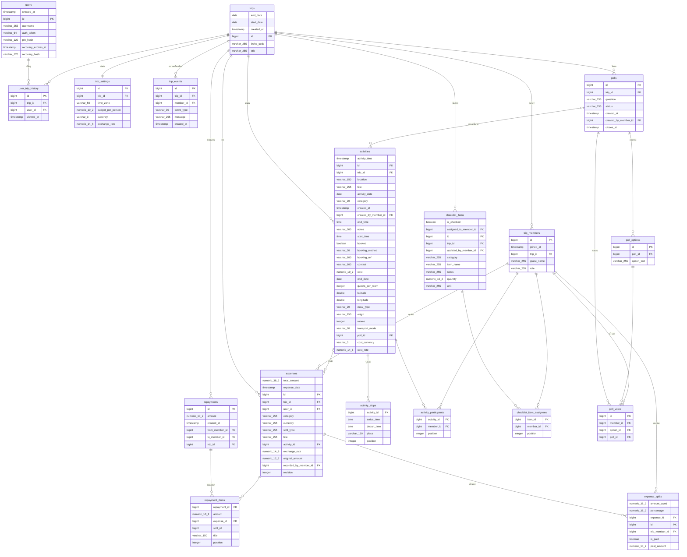

# Data Dictionary และ ER Diagram

พจนานุกรมข้อมูลของฐานข้อมูล PostgreSQL (18 ตาราง, Foreign Key 34 ตัว) สร้างจาก schema จริงหลังรัน Flyway V1-V5 (`code/src/main/resources/db/migration/`) ชนิดข้อมูล ค่าว่างได้หรือไม่ คีย์ และ Index ในตารางมาจากฐานข้อมูลโดยตรง ไม่ได้พิมพ์เอง

ตารางที่ Flyway เพิ่มเอง `flyway_schema_history` ไม่รวมในเอกสารนี้ ชื่อคอลัมน์ `position` ในตารางย่อยคือลำดับของรายการใน List

## สรุปความสัมพันธ์

| ชนิด | ความสัมพันธ์ |
|---|---|
| One-to-One | `trips` ↔ `trip_settings` (`trip_settings.trip_id` เป็น UNIQUE) |
| One-to-Many | `trips` → `trip_members`, `activities`, `expenses`, `polls`, `checklist_items`, `repayments`, `trip_events`, `user_trip_history` `expenses` → `expense_splits`, `activities` → `activity_stops`, `polls` → `poll_options`/`poll_votes`, `repayments` → `repayment_items` |
| Many-to-Many | `activities` ↔ `trip_members` ผ่าน `activity_participants` `checklist_items` ↔ `trip_members` ผ่าน `checklist_item_assignees` |

**ON DELETE:** `CASCADE` = ลบแม่แล้วลบลูกตาม, `SET NULL` = เก็บแถวไว้แต่ล้างตัวอ้างอิง, `ห้ามลบ` = ลบแม่ไม่ได้ถ้ายังมีลูก (ใช้กับข้อมูลเงิน)

## ER Diagram

> `trip_members` มีความสัมพันธ์กับหลายตารางมาก (สร้างบิล, ผู้ร่วมกิจกรรม, ผู้โหวต ฯลฯ) ในแผนภาพวาดเฉพาะเส้นหลัก ส่วนที่เหลืออยู่ในรายละเอียดแต่ละตารางด้านล่าง

## รายละเอียดตาราง

### กลุ่ม: ผู้ใช้และทริป

#### `users`

ผู้ใช้ระบบ (ชื่อเล่น + token ต่อเครื่อง ไม่มีอีเมล/รหัสผ่าน)

| คอลัมน์ | ชนิดข้อมูล | NULL | คีย์/ข้อจำกัด | คำอธิบาย |
|---|---|---|---|---|
| `created_at` | timestamp | ว่างได้ | - | เวลาที่สร้างรายการ |
| `id` | bigint | ไม่ว่าง | PK | รหัสหลัก สร้างอัตโนมัติ |
| `username` | varchar(255) | ไม่ว่าง | UNIQUE | ชื่อเล่นที่ใช้เข้าระบบ (ซ้ำกันไม่ได้) |
| `auth_token` | varchar(64) | ว่างได้ | UNIQUE | token ประจำเครื่อง ส่งในหัว X-Auth-Token ทุก request (ซ้ำกันไม่ได้) |
| `pin_hash` | varchar(120) | ว่างได้ | - | PIN ที่ผ่านการแฮช (PBKDF2) ใช้ยืนยันเมื่อเข้าจากเครื่องอื่น ไม่เก็บ PIN จริง |
| `recovery_expires_at` | timestamp | ว่างได้ | - | เวลาที่รหัสกู้คืนหมดอายุ (30 นาทีหลังออกรหัส) |
| `recovery_hash` | varchar(120) | ว่างได้ | - | รหัสกู้คืน 6 หลักที่ผ่านการแฮช (คนสร้างทริปออกให้เพื่อนที่เปลี่ยนเครื่อง) |

#### `trips`

ทริป: ข้อมูลหลักที่เหลือหลังแยกตั้งค่าไปที่ trip_settings

| คอลัมน์ | ชนิดข้อมูล | NULL | คีย์/ข้อจำกัด | คำอธิบาย |
|---|---|---|---|---|
| `end_date` | date | ว่างได้ | - | วันสิ้นสุดทริป |
| `start_date` | date | ว่างได้ | - | วันเริ่มทริป |
| `created_at` | timestamp | ว่างได้ | - | เวลาที่สร้างรายการ |
| `id` | bigint | ไม่ว่าง | PK | รหัสหลัก สร้างอัตโนมัติ |
| `invite_code` | varchar(255) | ว่างได้ | - | รหัสเชิญให้เพื่อนเข้าร่วม |
| `title` | varchar(255) | ว่างได้ | - | ชื่อทริป |

- **Index** `idx_trips_invite_code` (invite_code)

#### `trip_settings`

ตั้งค่าของทริป (One-to-One กับ trips ผ่าน trip_id ที่เป็น UNIQUE)

| คอลัมน์ | ชนิดข้อมูล | NULL | คีย์/ข้อจำกัด | คำอธิบาย |
|---|---|---|---|---|
| `id` | bigint | ไม่ว่าง | PK | รหัสหลัก สร้างอัตโนมัติ |
| `trip_id` | bigint | ไม่ว่าง | FK → `trips.id` (CASCADE) UNIQUE | ทริปเจ้าของการตั้งค่า (ทริปละ 1 แถว) |
| `time_zone` | varchar(50) | ว่างได้ | - | เขตเวลาของที่เที่ยว (IANA เช่น Asia/Tokyo) ว่าง = เวลาไทย |
| `budget_per_person` | numeric(10,2) | ว่างได้ | - | งบที่ตั้งใจใช้ต่อคน (บาท) ว่าง = ยังไม่ตั้ง |
| `currency` | varchar(3) | ว่างได้ | - | สกุลเงินท้องถิ่นของที่เที่ยว (รหัส 3 ตัว เช่น JPY) ว่าง = ใช้บาทอย่างเดียว |
| `exchange_rate` | numeric(14,6) | ว่างได้ | - | เรท 1 หน่วยสกุลท้องถิ่น = กี่บาท |

#### `trip_members`

สมาชิกในทริป (คนเดียวกันอยู่ในทริปเดียวกันได้แถวเดียว)

| คอลัมน์ | ชนิดข้อมูล | NULL | คีย์/ข้อจำกัด | คำอธิบาย |
|---|---|---|---|---|
| `id` | bigint | ไม่ว่าง | PK | รหัสหลัก สร้างอัตโนมัติ |
| `joined_at` | timestamp | ว่างได้ | - | เวลาที่เข้าร่วมทริป |
| `trip_id` | bigint | ไม่ว่าง | FK → `trips.id` (ห้ามลบ (NO ACTION)) UNIQUE ร่วม (trip_id, guest_name) | ทริปที่เป็นสมาชิก |
| `guest_name` | varchar(255) | ไม่ว่าง | UNIQUE ร่วม (trip_id, guest_name) | ชื่อเล่นของสมาชิกในทริป (ซ้ำในทริปเดียวกันไม่ได้) ตรงกับ users.username |
| `role` | varchar(255) | ไม่ว่าง | - | บทบาท: ADMIN (คนสร้างทริป) หรือ MEMBER |

- **Unique ร่วม** `uk_trip_members_trip_guest`: (trip_id, guest_name)
- **Index** `idx_trip_members_trip` (trip_id)

#### `user_trip_history`

ทริปที่ผู้ใช้เปิดดูล่าสุด (ใช้เรียงในหน้าแรก)

| คอลัมน์ | ชนิดข้อมูล | NULL | คีย์/ข้อจำกัด | คำอธิบาย |
|---|---|---|---|---|
| `id` | bigint | ไม่ว่าง | PK | รหัสหลัก สร้างอัตโนมัติ |
| `trip_id` | bigint | ไม่ว่าง | FK → `trips.id` (CASCADE) | ทริปที่เปิด |
| `user_id` | bigint | ไม่ว่าง | FK → `users.id` (CASCADE) | ผู้ใช้ |
| `viewed_at` | timestamp | ว่างได้ | - | เวลาที่เปิดดูล่าสุด |

- **Index** `idx_user_trip_history_user` (user_id)

#### `trip_events`

ประวัติความเคลื่อนไหวของทริป (เขียนโดย Observer: TripEventListener)

| คอลัมน์ | ชนิดข้อมูล | NULL | คีย์/ข้อจำกัด | คำอธิบาย |
|---|---|---|---|---|
| `id` | bigint | ไม่ว่าง | PK | รหัสหลัก สร้างอัตโนมัติ |
| `trip_id` | bigint | ไม่ว่าง | FK → `trips.id` (CASCADE) | ทริป |
| `member_id` | bigint | ว่างได้ | FK → `trip_members.id` (SET NULL) | สมาชิกที่ทำรายการ (ว่างได้ ถ้าสมาชิกออกจากทริปแล้ว) |
| `event_type` | varchar(30) | ไม่ว่าง | - | ชนิดเหตุการณ์ เช่น EXPENSE_ADDED, REPAYMENT_RECORDED |
| `message` | varchar(255) | ไม่ว่าง | - | ข้อความที่แสดงผู้ใช้ |
| `created_at` | timestamp | ไม่ว่าง | - | เวลาที่สร้างรายการ |

- **Index** `idx_trip_events_trip_created` (trip_id, created_at DESC)

### กลุ่ม: แพลนทริป

#### `activities`

กิจกรรมในแพลนของทริป (ช่องที่ใช้ขึ้นกับประเภท category)

| คอลัมน์ | ชนิดข้อมูล | NULL | คีย์/ข้อจำกัด | คำอธิบาย |
|---|---|---|---|---|
| `activity_time` | timestamp | ว่างได้ | - | วัน+เวลาแบบเดิม (ข้อมูลเก่า) ระบบยังอัปเดตให้ตรงกับ activity_date/start_time เสมอ |
| `id` | bigint | ไม่ว่าง | PK | รหัสหลัก สร้างอัตโนมัติ |
| `trip_id` | bigint | ว่างได้ | FK → `trips.id` (ห้ามลบ (NO ACTION)) | ทริปที่กิจกรรมอยู่ |
| `location` | varchar(150) | ว่างได้ | - | สถานที่ |
| `title` | varchar(255) | ว่างได้ | - | ชื่อกิจกรรม |
| `activity_date` | date | ว่างได้ | - | วันที่ทำกิจกรรม |
| `category` | varchar(20) | ว่างได้ | - | ประเภท: TRAVEL, FOOD, STAY, SIGHTSEEING, ACTIVITY, OTHER |
| `created_at` | timestamp | ว่างได้ | - | เวลาที่สร้างรายการ |
| `created_by_member_id` | bigint | ว่างได้ | FK → `trip_members.id` (SET NULL) | สมาชิกผู้สร้างกิจกรรม |
| `end_time` | time | ว่างได้ | - | เวลาสิ้นสุด |
| `notes` | varchar(500) | ว่างได้ | - | บันทึกเพิ่มเติม |
| `start_time` | time | ว่างได้ | - | เวลาเริ่ม |
| `booked` | boolean | ว่างได้ | - | จองแล้วหรือยัง |
| `booking_method` | varchar(20) | ว่างได้ | - | ช่องทางจอง: ONLINE, PHONE, PAGE |
| `booking_ref` | varchar(100) | ว่างได้ | - | เลขการจอง/เลขเที่ยว/ที่นั่ง |
| `contact` | varchar(100) | ว่างได้ | - | ช่องทางติดต่อ |
| `cost` | numeric(10,2) | ว่างได้ | - | ค่าใช้จ่ายโดยประมาณ (ที่พัก = ต่อห้องต่อคืน, ประเภทอื่น = ต่อคน) |
| `end_date` | date | ว่างได้ | - | วันสิ้นสุด (ที่พักหลายคืน/เดินทางข้ามวัน) |
| `guests_per_room` | integer | ว่างได้ | - | จำนวนคนต่อห้อง (เฉพาะ STAY) |
| `latitude` | double | ว่างได้ | - | ละติจูด |
| `longitude` | double | ว่างได้ | - | ลองจิจูด |
| `meal_type` | varchar(20) | ว่างได้ | - | มื้ออาหาร: BREAKFAST, LUNCH, DINNER, SNACK, LATE (เฉพาะ FOOD) |
| `origin` | varchar(150) | ว่างได้ | - | ต้นทาง (เฉพาะการเดินทาง) |
| `rooms` | integer | ว่างได้ | - | จำนวนห้อง (เฉพาะ STAY) |
| `transport_mode` | varchar(20) | ว่างได้ | - | ยานพาหนะ: CAR, VAN, BUS, TRAIN, PLANE, BOAT, OTHER |
| `poll_id` | bigint | ว่างได้ | FK → `polls.id` (SET NULL) | เพิ่มมาจากผลโหวตใด (ว่าง = เพิ่มเอง) |
| `cost_currency` | varchar(3) | ว่างได้ | - | สกุลเงินของค่าใช้จ่าย ว่าง = บาท |
| `cost_rate` | numeric(14,6) | ว่างได้ | - | เรทของค่าใช้จ่าย (1 หน่วย = กี่บาท) |

- **Index** `idx_activities_trip` (trip_id)

#### `activity_stops`

จุดแวะ/เมืองต่อเครื่องของกิจกรรมเดินทาง เรียงตามลำดับ (ข้อมูลฝัง ElementCollection)

| คอลัมน์ | ชนิดข้อมูล | NULL | คีย์/ข้อจำกัด | คำอธิบาย |
|---|---|---|---|---|
| `activity_id` | bigint | ไม่ว่าง | PK (ร่วม) FK → `activities.id` (ห้ามลบ (NO ACTION)) | กิจกรรมที่จุดแวะนี้เป็นส่วนหนึ่ง |
| `arrive_time` | time | ว่างได้ | - | เวลาถึง |
| `depart_time` | time | ว่างได้ | - | เวลาออก |
| `place` | varchar(150) | ว่างได้ | - | ชื่อสถานที่/เมือง |
| `position` | integer | ไม่ว่าง | PK (ร่วม) | ลำดับในรายการ (เริ่มที่ 0) |

#### `activity_participants`

ตารางกลาง Many-to-Many: สมาชิกที่ไปร่วมกิจกรรม

| คอลัมน์ | ชนิดข้อมูล | NULL | คีย์/ข้อจำกัด | คำอธิบาย |
|---|---|---|---|---|
| `activity_id` | bigint | ไม่ว่าง | PK (ร่วม) FK → `activities.id` (ห้ามลบ (NO ACTION)) | กิจกรรม |
| `member_id` | bigint | ว่างได้ | FK → `trip_members.id` (CASCADE) | สมาชิกที่ไปด้วย |
| `position` | integer | ไม่ว่าง | PK (ร่วม) | ลำดับในรายการ (เริ่มที่ 0) |

### กลุ่ม: บิลและหนี้

#### `expenses`

บิลค่าใช้จ่ายของทริป

| คอลัมน์ | ชนิดข้อมูล | NULL | คีย์/ข้อจำกัด | คำอธิบาย |
|---|---|---|---|---|
| `total_amount` | numeric(38,2) | ว่างได้ | - | ยอดบิลเป็นเงินบาท (ปัด 2 ตำแหน่ง) ผลรวมส่วนแบ่งต้องเท่ายอดนี้ |
| `expense_date` | timestamp | ว่างได้ | - | วัน-เวลาที่จ่าย |
| `id` | bigint | ไม่ว่าง | PK | รหัสหลัก สร้างอัตโนมัติ |
| `trip_id` | bigint | ว่างได้ | FK → `trips.id` (ห้ามลบ (NO ACTION)) | ทริปที่บิลอยู่ |
| `user_id` | bigint | ว่างได้ | FK → `trip_members.id` (ห้ามลบ (NO ACTION)) | สมาชิกที่เป็นคนจ่ายบิล (ชื่อคอลัมน์เป็น user_id แต่ชี้ไปที่ trip_members ไม่ใช่ users) |
| `category` | varchar(255) | ว่างได้ | - | หมวดค่าใช้จ่าย (ข้อความจากหน้าเว็บ) |
| `currency` | varchar(255) | ว่างได้ | - | สกุลเงินตามใบเสร็จ (THB = บาท) |
| `split_type` | varchar(255) | ว่างได้ | - | วิธีหาร: EQUAL (เท่ากัน) หรือ CUSTOM (กำหนดยอดเอง) |
| `title` | varchar(255) | ว่างได้ | - | ชื่อรายการ |
| `activity_id` | bigint | ว่างได้ | FK → `activities.id` (SET NULL) | กิจกรรมในแพลนที่บิลนี้ผูกอยู่ (ว่างได้) |
| `exchange_rate` | numeric(14,6) | ว่างได้ | - | เรทที่ใช้แปลง (1 หน่วย = กี่บาท) ว่างถ้าเป็นบาท |
| `original_amount` | numeric(12,2) | ว่างได้ | - | ยอดตามใบเสร็จเป็นสกุลต่างประเทศ ว่างถ้าเป็นบาท |
| `recorded_by_member_id` | bigint | ว่างได้ | FK → `trip_members.id` (SET NULL) | สมาชิกที่กดบันทึกบิล (บันทึกแทนคนจ่ายได้) |
| `revision` | integer | ว่างได้ | - | เลขรุ่นของบิล เพิ่มทุกครั้งที่แก้ ใช้กันเครื่องหนึ่งบันทึกทับอีกเครื่อง (ชนกัน = 409) |

- **Index** `idx_expenses_trip` (trip_id)

#### `expense_splits`

ส่วนแบ่งของแต่ละคนในบิล (ว่าใครต้องจ่ายเท่าไร)

| คอลัมน์ | ชนิดข้อมูล | NULL | คีย์/ข้อจำกัด | คำอธิบาย |
|---|---|---|---|---|
| `amount_owed` | numeric(38,2) | ว่างได้ | - | ยอดที่ต้องจ่าย (บาท) |
| `percentage` | numeric(38,2) | ว่างได้ | - | สัดส่วนของยอดบิล (%) |
| `expense_id` | bigint | ว่างได้ | FK → `expenses.id` (ห้ามลบ (NO ACTION)) | บิลที่ส่วนแบ่งนี้อยู่ |
| `id` | bigint | ไม่ว่าง | PK | รหัสหลัก สร้างอัตโนมัติ |
| `trip_member_id` | bigint | ว่างได้ | FK → `trip_members.id` (ห้ามลบ (NO ACTION)) | สมาชิกที่ต้องจ่าย |
| `is_paid` | boolean | ไม่ว่าง | - | จ่ายครบแล้วหรือยัง |
| `paid_amount` | numeric(10,2) | ว่างได้ | - | จ่ายคืนไปแล้วเท่าไร (จ่ายเป็นงวดได้) ว่าง = ยังไม่เคยจ่าย |

- **Index** `idx_expense_splits_expense` (expense_id)
- **Index** `idx_expense_splits_member` (trip_member_id)

#### `repayments`

การรับเงินคืน 1 ครั้ง (หักไปที่หนี้ในบิลหลายใบได้)

| คอลัมน์ | ชนิดข้อมูล | NULL | คีย์/ข้อจำกัด | คำอธิบาย |
|---|---|---|---|---|
| `id` | bigint | ไม่ว่าง | PK | รหัสหลัก สร้างอัตโนมัติ |
| `amount` | numeric(10,2) | ว่างได้ | - | ยอดที่รับ (บาท) |
| `created_at` | timestamp | ว่างได้ | - | เวลาที่สร้างรายการ |
| `from_member_id` | bigint | ว่างได้ | FK → `trip_members.id` (ห้ามลบ (NO ACTION)) | ผู้โอนเงิน (ลูกหนี้) |
| `to_member_id` | bigint | ว่างได้ | FK → `trip_members.id` (ห้ามลบ (NO ACTION)) | ผู้รับเงิน (เจ้าหนี้) |
| `trip_id` | bigint | ว่างได้ | FK → `trips.id` (ห้ามลบ (NO ACTION)) | ทริปที่เกิดการรับเงิน |

- **Index** `idx_repayments_trip` (trip_id)

#### `repayment_items`

รายการย่อยของการรับเงิน: หักไปที่บิลไหนเท่าไร (ข้อมูลฝัง ElementCollection)

| คอลัมน์ | ชนิดข้อมูล | NULL | คีย์/ข้อจำกัด | คำอธิบาย |
|---|---|---|---|---|
| `repayment_id` | bigint | ไม่ว่าง | PK (ร่วม) FK → `repayments.id` (ห้ามลบ (NO ACTION)) | การรับเงินที่รายการนี้เป็นส่วนหนึ่ง |
| `amount` | numeric(10,2) | ว่างได้ | - | ยอดที่หักจากบิลนี้ |
| `expense_id` | bigint | ว่างได้ | FK → `expenses.id` (ห้ามลบ (NO ACTION)) | บิลที่ถูกหัก |
| `split_id` | bigint | ว่างได้ | - | ส่วนแบ่ง (expense_splits) ที่ถูกหัก (เก็บเป็นตัวเลขอ้างอิง ไม่มี FK เพราะส่วนแบ่งถูกสร้างใหม่ตอนแก้บิล) |
| `title` | varchar(150) | ว่างได้ | - | ชื่อบิลตอนรับเงิน (เก็บสำเนาไว้แสดงประวัติ) |
| `position` | integer | ไม่ว่าง | PK (ร่วม) | ลำดับในรายการ (เริ่มที่ 0) |

### กลุ่ม: โหวตและเช็กลิสต์

#### `polls`

โหวตตัดสินใจร่วมกันในทริป

| คอลัมน์ | ชนิดข้อมูล | NULL | คีย์/ข้อจำกัด | คำอธิบาย |
|---|---|---|---|---|
| `id` | bigint | ไม่ว่าง | PK | รหัสหลัก สร้างอัตโนมัติ |
| `trip_id` | bigint | ว่างได้ | FK → `trips.id` (ห้ามลบ (NO ACTION)) | ทริปที่โหวตอยู่ |
| `question` | varchar(255) | ว่างได้ | - | คำถาม |
| `status` | varchar(255) | ว่างได้ | - | สถานะ: ACTIVE หรือ CLOSED |
| `created_at` | timestamp | ว่างได้ | - | เวลาที่สร้างรายการ |
| `created_by_member_id` | bigint | ว่างได้ | FK → `trip_members.id` (SET NULL) | สมาชิกผู้สร้างโหวต |
| `closes_at` | timestamp | ว่างได้ | - | เวลาปิดรับโหวตอัตโนมัติ ว่าง = เปิดจนกว่าคนสร้างจะกดปิด |

- **Index** `idx_polls_trip` (trip_id)

#### `poll_options`

ตัวเลือกของโหวต

| คอลัมน์ | ชนิดข้อมูล | NULL | คีย์/ข้อจำกัด | คำอธิบาย |
|---|---|---|---|---|
| `id` | bigint | ไม่ว่าง | PK | รหัสหลัก สร้างอัตโนมัติ |
| `poll_id` | bigint | ว่างได้ | FK → `polls.id` (CASCADE) | โหวตที่ตัวเลือกนี้อยู่ |
| `option_text` | varchar(255) | ว่างได้ | - | ข้อความตัวเลือก |

- **Index** `idx_poll_options_poll` (poll_id)

#### `poll_votes`

คะแนนโหวต: 1 คนโหวตได้ 1 ตัวเลือกต่อ 1 โหวต

| คอลัมน์ | ชนิดข้อมูล | NULL | คีย์/ข้อจำกัด | คำอธิบาย |
|---|---|---|---|---|
| `id` | bigint | ไม่ว่าง | PK | รหัสหลัก สร้างอัตโนมัติ |
| `member_id` | bigint | ว่างได้ | FK → `trip_members.id` (CASCADE) UNIQUE ร่วม (poll_id, member_id) | สมาชิกผู้โหวต |
| `option_id` | bigint | ว่างได้ | FK → `poll_options.id` (CASCADE) | ตัวเลือกที่เลือก |
| `poll_id` | bigint | ว่างได้ | FK → `polls.id` (CASCADE) UNIQUE ร่วม (poll_id, member_id) | โหวต |

- **Unique ร่วม** `poll_votes_poll_id_member_id_key`: (poll_id, member_id) (ฐานข้อมูลเก่าที่เคยสร้างด้วย Hibernate มี constraint ซ้ำอีกตัว `uk5aui3ahbiud7lch9cr4blftis` ซึ่ง V5 ลบทิ้งให้แล้ว)

#### `checklist_items`

รายการสิ่งของที่ต้องเตรียมสำหรับทริป

| คอลัมน์ | ชนิดข้อมูล | NULL | คีย์/ข้อจำกัด | คำอธิบาย |
|---|---|---|---|---|
| `is_checked` | boolean | ว่างได้ | - | เตรียมแล้วหรือยัง |
| `assigned_to_member_id` | bigint | ว่างได้ | FK → `trip_members.id` (SET NULL) | ผู้รับผิดชอบคนแรก (คอลัมน์เดิม เก็บไว้ให้ข้อมูลเก่ายังอ่านได้ ปัจจุบันใช้ checklist_item_assignees) |
| `id` | bigint | ไม่ว่าง | PK | รหัสหลัก สร้างอัตโนมัติ |
| `trip_id` | bigint | ว่างได้ | FK → `trips.id` (CASCADE) | ทริปที่เป็นเจ้าของรายการ |
| `updated_by_member_id` | bigint | ว่างได้ | FK → `trip_members.id` (SET NULL) | สมาชิกที่อัปเดตสถานะล่าสุด |
| `category` | varchar(255) | ว่างได้ | - | หมวดของสิ่งของ (รหัสจากหน้าเว็บ) |
| `item_name` | varchar(255) | ว่างได้ | - | ชื่อสิ่งของ |
| `notes` | varchar(255) | ว่างได้ | - | โน้ตของชิ้นนี้ (ยี่ห้อ ขนาด ร้านที่ซื้อ) |
| `quantity` | numeric(10,2) | ว่างได้ | - | จำนวน ว่าง = ไม่ระบุ |
| `unit` | varchar(255) | ว่างได้ | - | หน่วย (เช่น ขวด กก.) |

- **Index** `idx_checklist_items_trip` (trip_id)

#### `checklist_item_assignees`

ตารางกลาง Many-to-Many: ผู้รับผิดชอบสิ่งของ (มีได้หลายคน)

| คอลัมน์ | ชนิดข้อมูล | NULL | คีย์/ข้อจำกัด | คำอธิบาย |
|---|---|---|---|---|
| `item_id` | bigint | ไม่ว่าง | PK (ร่วม) FK → `checklist_items.id` (ห้ามลบ (NO ACTION)) | รายการสิ่งของ |
| `member_id` | bigint | ว่างได้ | FK → `trip_members.id` (CASCADE) | สมาชิกผู้รับผิดชอบ |
| `position` | integer | ไม่ว่าง | PK (ร่วม) | ลำดับในรายการ (เริ่มที่ 0) |

## หมายเหตุเรื่องการตั้งชื่อ

- `expenses.user_id` ชี้ไปที่ `trip_members` (สมาชิกผู้จ่าย) ไม่ใช่ `users` ชื่อคอลัมน์เป็นของเดิมก่อนแยกแนวคิด "ผู้ใช้" กับ "สมาชิกทริป"
- `checklist_items.assigned_to_member_id` เป็นคอลัมน์เดิม (ผู้รับผิดชอบคนเดียว) ข้อมูลเก่าถูกย้ายเข้า `checklist_item_assignees` ใน V2 ตัวคอลัมน์เก็บไว้ให้อ่านข้อมูลเก่า
- `repayment_items.split_id` เก็บเป็นตัวเลขอ้างอิงโดยไม่มี FK เพราะ `expense_splits` ถูกสร้างใหม่เมื่อแก้บิล (แก้ได้เฉพาะบิลที่ยังไม่มีการจ่ายคืน)
