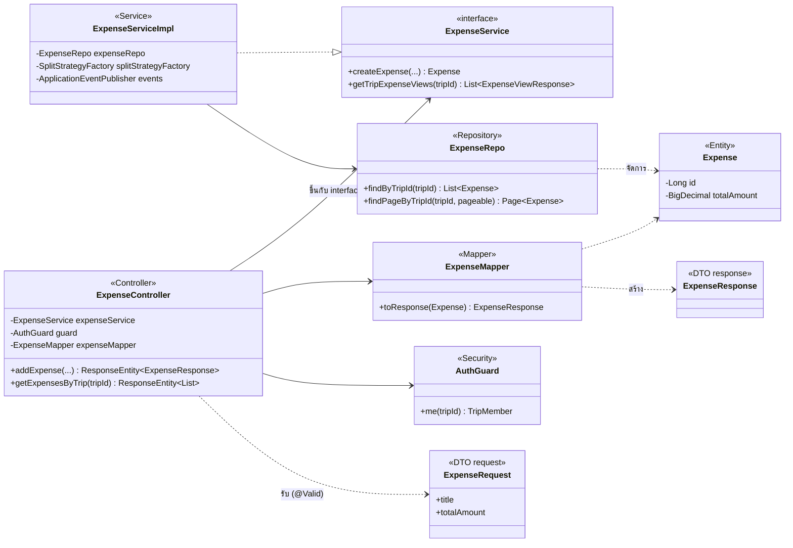
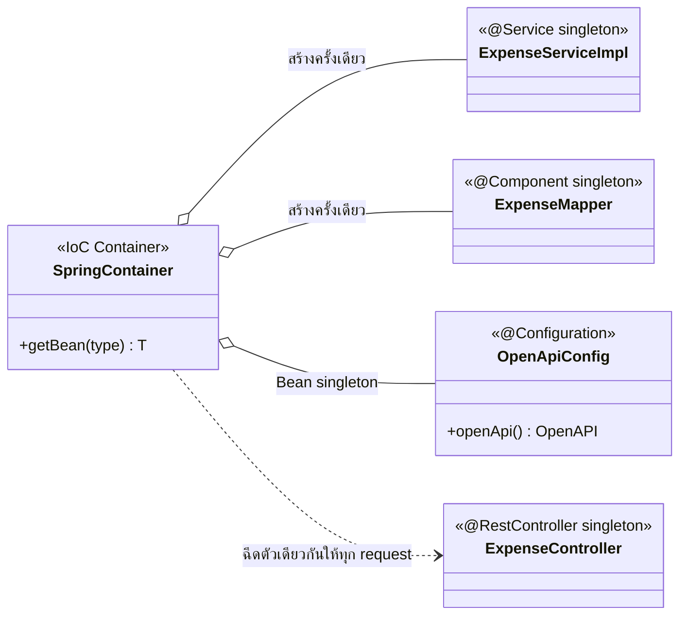
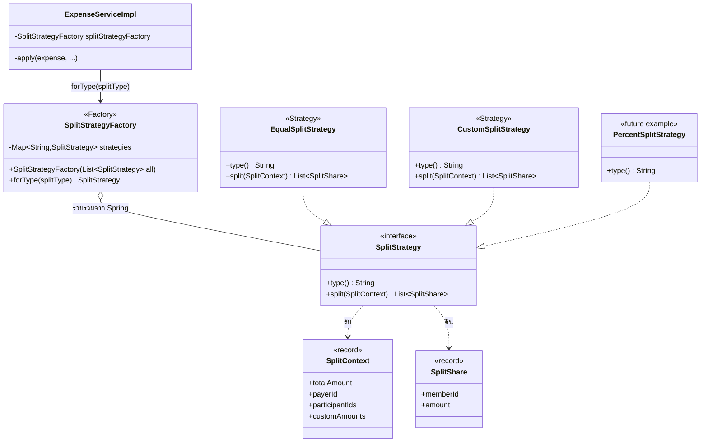
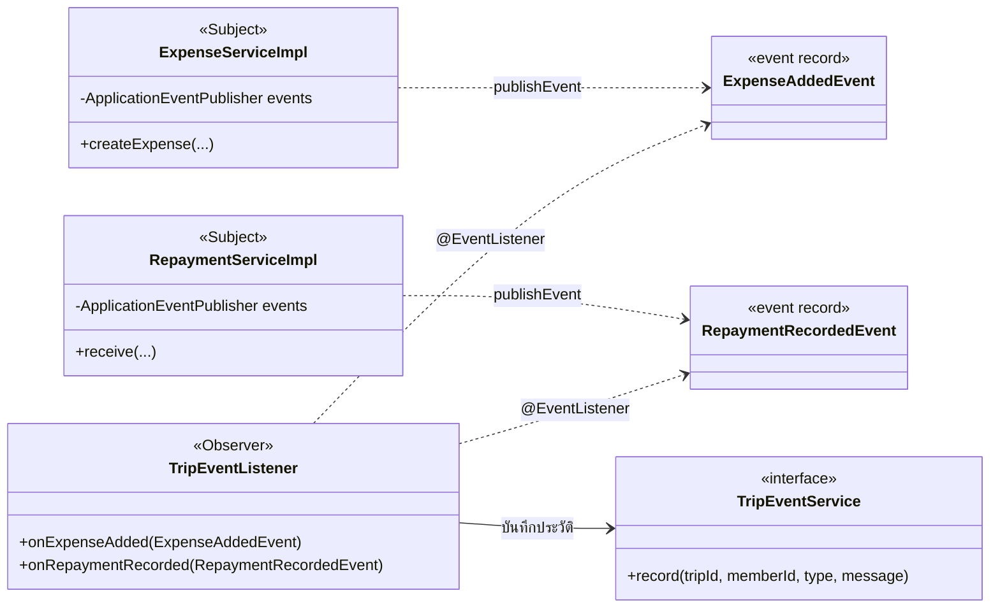
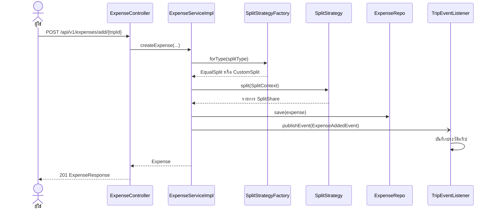

# Design Patterns

สรุป Design Pattern ที่ใช้ในโปรเจกต์ Party & Trip Expense Splitter ว่าแก้ปัญหาอะไร อยู่ไฟล์/คลาสไหน และมี Class Diagram ประกอบ
ทุกรายการมีที่มาจากปัญหาจริงในโค้ด ไม่ได้ใส่ Pattern เพื่อให้ครบ และข้อที่ยังไม่ตรงตำราเป๊ะ ๆ ระบุไว้ในช่อง "หมายเหตุ"

- **ที่มาของเลขบรรทัด:** นับจากโค้ด ณ commit `29aac8a` (branch `artitaya_6430212592_01`)
- **path ย่อ:** ทุกไฟล์อยู่ใต้ `src/main/java/com/cp/party_trip/`

## 1) Enterprise / Architectural Patterns (บังคับทุกกลุ่ม)

| Pattern | ปัญหาที่แก้ | ไฟล์/คลาสที่ใช้ | Class Diagram |
|---|---|---|---|
| **Layered Architecture** | กัน Controller, Business Logic และ SQL ปนกัน เปลี่ยนชั้นหนึ่งไม่กระทบอีกชั้น | `controller/` → `service/` + `service/impl/` → `repository/` → `model/` และ `dto/`, `mapper/`, `config/` | [แผนภาพ A](#a-layered--dependency-injection--service-layer) |
| **MVC** | แยกหน้าจอ ข้อมูล และตัวควบคุม | **Model:** `model/*` (Entity) + `dto/*`<br>**View:** `src/main/resources/static/*.html` + `js/ui.js` (HTML/JS เรียก REST)<br>**Controller:** `controller/*` (เช่น `ExpenseController.java:26`) | [แผนภาพ A](#a-layered--dependency-injection--service-layer) |
| **Repository** | ซ่อนรายละเอียดการเข้าถึงฐานข้อมูล Service ไม่เขียน SQL/EntityManager เอง | `repository/ExpenseRepo.java:14`, `TripMemberRepo.java:13`, `ExpenseSplitRepo.java:7` ฯลฯ (13 ไฟล์) สืบทอด `JpaRepository` ของ Spring Data JPA | [แผนภาพ A](#a-layered--dependency-injection--service-layer) |
| **Service Layer** | รวม Business Logic และ Transaction ไว้ที่เดียว ให้ Controller เรียกใช้ซ้ำได้ | interface ใน `service/*.java` + คลาสจริงใน `service/impl/*ServiceImpl.java` (เช่น `ExpenseServiceImpl.java:40` มี `@Service`, `@Transactional` บรรทัด 67) | [แผนภาพ A](#a-layered--dependency-injection--service-layer) |
| **DTO + Mapper** | แยก Entity ออกจาก API Contract: ไม่หลุดฟิลด์ลับ (เช่น `pinHash`, `authToken`), เปลี่ยนฐานข้อมูลโดย JSON ไม่เปลี่ยน, validate ที่ขอบ API | **Request:** `dto/request/*` (เช่น `ExpenseRequest.java:15`) มี Bean Validation<br>**Response:** `dto/response/*` (เช่น `ExpenseResponse.java:8`, `ExpenseViewResponse.java:9`)<br>**Mapper:** `mapper/*` (เช่น `TripMapper.java:13`) | [แผนภาพ A](#a-layered--dependency-injection--service-layer) |
| **Dependency Injection** | ให้ Spring ประกอบ object และสลับตัวจริง/ตัวจำลองได้ (ทดสอบง่าย) | Constructor Injection ทุกคลาส ไม่มี `@Autowired` (เช่น `ExpenseController.java:36`, `ExpenseServiceImpl.java:52`, `AuthGuard.java:23`) | [แผนภาพ A](#a-layered--dependency-injection--service-layer) |

### A) Layered + Dependency Injection + Service Layer

ตัวอย่างฟีเจอร์ "บิล" (Expense) แสดงทุกชั้น และลูกศรบอกว่าใครขึ้นกับใคร ชั้นบนขึ้นกับ interface ของชั้นล่างเท่านั้น



---

## 2) GoF Patterns

ใบงานให้เลือก 1 กลุ่ม อย่างน้อย 3 แบบ: โปรเจกต์นี้ใช้ **กลุ่ม Creational (Singleton, Factory, Builder)** เป็นกลุ่มหลัก
และมี **Behavioral (Strategy, Observer)** เพิ่มอีก 2 แบบ ที่ใช้เพราะแก้ปัญหาจริง

| Pattern | กลุ่ม | ปัญหาที่แก้ | ไฟล์/คลาสที่ใช้ | Class Diagram | หมายเหตุ |
|---|---|---|---|---|---|
| **Singleton** | Creational | ต้องการ object เดียวที่ใช้ร่วมทั้งแอป (Service, Repository, Mapper ไม่ต้องสร้างซ้ำทุก request และไม่มีสถานะของผู้ใช้ปนกัน) | ทุกคลาสที่มี `@Service` (เช่น `ExpenseServiceImpl.java:40`), `@Component` (เช่น `EqualSplitStrategy.java:14`), `@RestController` และ `@Bean` (`config/OpenApiConfig.java:15`) | [แผนภาพ B](#b-singleton-ผ่าน-spring-container) | ใช้ผ่าน IoC Container ของ Spring (ขอบเขต singleton เป็นค่าเริ่มต้น ไม่มี `@Scope` ในโค้ดเลย) ไม่ได้เขียน `getInstance()` เอง ซึ่งตรงกับตัวอย่าง "@Bean Singleton" ของใบงาน |
| **Factory** | Creational | เลือกวิธีหารบิลจากรหัส `splitType` ที่ส่งมา โดย Service ไม่ต้องรู้จักคลาสวิธีหารแต่ละตัว และไม่มี if-else/switch | `service/split/SplitStrategyFactory.java:12` (เมธอด `forType` บรรทัด 22) ใช้ที่ `service/impl/ExpenseServiceImpl.java:190` | [แผนภาพ C](#c-strategy--factory-วิธีหารบิล) | เป็น **Simple Factory / Registry** (รับ `List<SplitStrategy>` จาก Spring เก็บเป็น Map ตามรหัส) ไม่ใช่ Factory Method ตามตำรา GoF ที่ต้องมี subclass ของ Creator |
| **Builder** | Creational | `ActivityResponse` มี 28 ช่อง หลายคู่ชนิดเดียวกันอยู่ติดกัน (`startTime`/`endTime`, `latitude`/`longitude`) เรียก constructor ผิดตำแหน่งแล้วคอมไพล์ผ่านแต่ข้อมูลผิด | `dto/response/ActivityResponse.java:10` (`builder()` บรรทัด 47, `Builder` บรรทัด 51, `build()` บรรทัด 224) ใช้ใน `mapper/ActivityMapper.java:16-27` | [แผนภาพ D](#d-builder-activityresponse) | ใช้เฉพาะ DTO ที่ยาวเกินใช้ constructor ไหว DTO สั้นยังใช้ record ตรงๆ |
| **Strategy** | Behavioral | วิธีหารบิลเปลี่ยนได้ (หารเท่ากัน / กำหนดยอดเอง) และต้องเพิ่มวิธีใหม่ได้โดยไม่แก้ Service เดิม | `service/split/SplitStrategy.java:7`, `EqualSplitStrategy.java:16`, `CustomSplitStrategy.java:19` ใช้ที่ `ExpenseServiceImpl.java:190, :244` | [แผนภาพ C](#c-strategy--factory-วิธีหารบิล) | เพิ่ม `PercentSplitStrategy` + `@Component` ก็ใช้ได้ทันที |
| **Observer** | Behavioral | บันทึกประวัติความเคลื่อนไหวของทริปโดยไม่ให้ Service บิล/การรับเงินต้องรู้จักตารางประวัติ | ผู้ส่ง: `ExpenseServiceImpl.java:91`, `RepaymentServiceImpl.java:117` (`ApplicationEventPublisher`)<br>เหตุการณ์: `event/ExpenseAddedEvent.java:6`, `event/RepaymentRecordedEvent.java:6`<br>ผู้ฟัง: `event/TripEventListener.java` (`@EventListener` บรรทัด 18, 24) | [แผนภาพ E](#e-observer-ประวัติความเคลื่อนไหว) | ใช้กลไก `ApplicationEvent` ของ Spring ตามตัวอย่างในใบงาน ผู้ฟังทำงานใน transaction เดียวกับผู้ส่ง |

---

### B) Singleton ผ่าน Spring Container



### C) Strategy + Factory (วิธีหารบิล)



### D) Builder (ActivityResponse)

```mermaid
classDiagram
    direction LR
    class ActivityMapper {
        <<Mapper>>
        +toResponse(Activity) ActivityResponse
    }
    class ActivityResponse {
        <<record>>
        +id, title, category, activityDate ...
        +builder()$ Builder
    }
    class Builder {
        <<Builder>>
        +id(Long) Builder
        +title(String) Builder
        +startTime(LocalTime) Builder
        +endTime(LocalTime) Builder
        +build() ActivityResponse
    }
    ActivityMapper --> Builder : ActivityResponse.builder()
    ActivityResponse +-- Builder : nested
    Builder ..> ActivityResponse : build()
```

### E) Observer (ประวัติความเคลื่อนไหว)



---

## ลำดับการเรียก (ตัวอย่าง: เพิ่มบิล)



## ข้อจำกัด (ตรงไปตรงมา)

- **Singleton** ใช้ผ่านกลไกของ Spring ไม่ได้เขียนคลาส Singleton เอง
- **Factory** เป็น Simple Factory ไม่ใช่ Factory Method แบบมี Creator subclass
- **Builder** ใช้กับ DTO เดียว (`ActivityResponse`) เพราะเป็นตัวเดียวที่ยาวพอจะคุ้ม
- **Strategy ที่ 3 (`PercentSplitStrategy`)** ในแผนภาพ C เป็นตัวอย่างการต่อขยาย ยังไม่มีในโค้ด
- กลุ่ม Behavioral มี Strategy และ Observer รวม 2 แบบ ไม่ถึง 3 จึงใช้กลุ่ม Creational (3 แบบ) เป็นตัวนับตามเกณฑ์ 5.2
