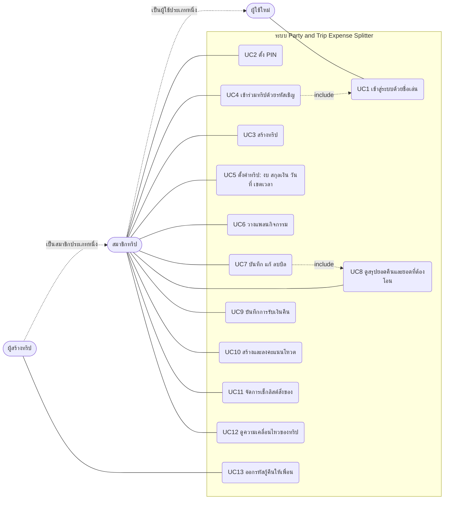

# Use Case Diagram และ Use Case Description

## Use Case Diagram

ผู้ใช้ทุกคนเข้าระบบด้วยชื่อเล่น ไม่มีรหัสผ่านหรืออีเมล สิทธิ์ในทริปแบ่งเป็น 2 บทบาท: **สมาชิก** (MEMBER) และ **ผู้สร้างทริป** (ADMIN)
ซึ่งทำได้ทุกอย่างที่สมาชิกทำได้ และออกรหัสกู้คืนให้เพื่อนได้เพิ่ม

## Use Case Description

### UC1 เข้าสู่ระบบด้วยชื่อเล่น

| หัวข้อ | รายละเอียด |
|---|---|
| ผู้กระทำ | ผู้ใช้ใหม่ / ผู้ใช้เดิม |
| เงื่อนไขก่อนเริ่ม | เปิดหน้าแรกของเว็บ |
| Main flow | 1. ผู้ใช้กรอกชื่อเล่น 2. ระบบตรวจชื่อ ถ้ายังไม่มีผู้ใช้ชื่อนี้ ระบบสร้างบัญชีและออก token ให้เครื่องนี้ 3. หน้าเว็บเก็บ token ไว้ แล้วส่งในหัว `X-Auth-Token` ทุก request |
| Alternative flow | A1 เครื่องเดิมที่มี token ตรงกัน: เข้าได้ทันที A2 ชื่อมีเจ้าของแล้วและเป็นเครื่องอื่น: ถ้าตั้ง PIN ไว้ ระบบขอ PIN (401 `PIN_REQUIRED`) ถ้าไม่ได้ตั้ง ตอบ 409 ให้ใช้ชื่ออื่นหรือขอรหัสกู้คืน A3 กรอก PIN ผิดหลายครั้ง: ระบบล็อกชั่วคราว |
| ผลลัพธ์ | ผู้ใช้ได้ token ประจำเครื่อง สามารถใช้งานส่วนอื่นได้ |

### UC4 เข้าร่วมทริปด้วยรหัสเชิญ

| หัวข้อ | รายละเอียด |
|---|---|
| ผู้กระทำ | สมาชิก (ผู้ใช้ที่เข้าสู่ระบบแล้ว) |
| เงื่อนไขก่อนเริ่ม | มี token และได้รหัสเชิญจากเพื่อน |
| Main flow | 1. ผู้ใช้กรอกรหัสเชิญ 2. ระบบค้นหาทริปจากรหัส (ไม่สนตัวพิมพ์) 3. ระบบเพิ่มผู้ใช้เป็นสมาชิก (role = MEMBER) ใช้ชื่อเล่นของเจ้าของ token ไม่ใช้ชื่อที่ส่งมาในคำขอ 4. ระบบบันทึกทริปนี้ลงประวัติของผู้ใช้ |
| Alternative flow | A1 ไม่พบรหัส: 404 ไม่พบทริป A2 เป็นสมาชิกอยู่แล้ว: ไม่สร้างซ้ำ ใช้สมาชิกเดิม (กดซ้ำหรือกดพร้อมกันได้) |
| ผลลัพธ์ | ผู้ใช้เป็นสมาชิกทริป และเห็นข้อมูลของทริปได้ |

### UC7 บันทึกบิล

| หัวข้อ | รายละเอียด |
|---|---|
| ผู้กระทำ | สมาชิกของทริป |
| เงื่อนไขก่อนเริ่ม | เป็นสมาชิกทริป |
| Main flow | 1. สมาชิกกรอกชื่อรายการ ยอด หมวด ผู้จ่าย ผู้ร่วมหาร และวิธีหาร (เท่ากัน / กำหนดเอง) 2. ระบบตรวจข้อมูล (Bean Validation) และตรวจว่าผู้เกี่ยวข้องอยู่ในทริปนี้ 3. ระบบเลือกวิธีหารตาม `splitType` (Strategy) แล้วคำนวณส่วนของแต่ละคนให้ผลรวมเท่ายอดบิล 4. ระบบบันทึกบิลและส่วนแบ่ง ตอบ 201 5. ระบบประกาศ event เพื่อบันทึกความเคลื่อนไหวของทริป |
| Alternative flow | A1 ข้อมูลไม่ถูกต้อง (ยอด ≤ 0, วิธีหารไม่รู้จัก, ผลรวมไม่เท่ายอดบิล): 400 พร้อมข้อความภาษาไทย A2 เงินต่างประเทศ: ยอดบาทต้องตรงกับ ยอดตามใบเสร็จ × เรท (คลาดได้ไม่เกิน 1 สตางค์) A3 ทำแทนผู้อื่น (ส่ง id ของคนอื่นเป็นผู้บันทึก): 403 |
| ผลลัพธ์ | มีบิลใหม่ในทริป และยอดหนี้ของสมาชิกถูกปรับ |

### UC9 บันทึกการรับเงินคืน

| หัวข้อ | รายละเอียด |
|---|---|
| ผู้กระทำ | สมาชิกที่เป็นเจ้าหนี้ (ผู้รับเงิน) |
| เงื่อนไขก่อนเริ่ม | เพื่อนคนหนึ่งยังค้างจ่ายบิลที่ผู้รับเป็นคนจ่าย |
| Main flow | 1. ผู้รับเลือกผู้โอนและกรอกยอดที่ได้รับ (เลือกบิลเองหรือให้ระบบเรียงบิลที่ค้างน้อยที่สุดก่อน) 2. ระบบล็อกผู้โอนเพื่อกันบันทึกซ้อนกัน แล้วคำนวณยอดค้างของผู้โอนต่อผู้รับ 3. ระบบหักยอดไปที่ส่วนแบ่งทีละบิล จ่ายครบเป็น "จ่ายแล้ว" ไม่ครบเก็บเป็นยอดที่จ่ายมา 4. ระบบบันทึกการรับเงิน ตอบ 201 และประกาศ event |
| Alternative flow | A1 ผู้โอนไม่ค้างอะไรเลย: 400 A2 ยอดที่ได้รับมากกว่ายอดค้าง: 400 A3 ผู้โอนกับผู้รับเป็นคนเดียวกัน: 400 A4 ยกเลิกการรับเงินได้เฉพาะคนที่รับเงิน (ไม่ใช่ผู้รับ: 403) A5 ยกเลิกได้เฉพาะรายการรับเงินล่าสุดของคู่ผู้โอน-ผู้รับ (รายการเก่าที่มีรายการใหม่กว่า: 409) |
| ผลลัพธ์ | ยอดค้างลดลงตามที่รับเงิน หน้าสรุปยอดคืนอัปเดต |

### UC10 ลงคะแนนโหวต

| หัวข้อ | รายละเอียด |
|---|---|
| ผู้กระทำ | สมาชิกของทริป |
| เงื่อนไขก่อนเริ่ม | มีโหวตที่ยังเปิดอยู่ในทริป |
| Main flow | 1. สมาชิกเลือกตัวเลือก 2. ระบบตรวจว่าโหวตยังไม่ปิด (และยังไม่เลยเวลาปิดอัตโนมัติ) และผู้โหวตเป็นสมาชิกทริป 3. ระบบบันทึกคะแนน ตอบข้อความ "บันทึกคะแนนโหวตสำเร็จ" |
| Alternative flow | A1 เคยโหวตแล้ว เลือกตัวเลือกอื่น: เปลี่ยนคะแนนเป็นตัวเลือกใหม่ A2 กดตัวเลือกเดิมซ้ำ: ยกเลิกคะแนน A3 โหวตปิดแล้ว: 400 ถูกปิดรับคะแนน A4 กดโหวตพร้อมกัน 2 ครั้ง: ฐานข้อมูลกันซ้ำ ตอบ 409 ให้ลองใหม่ |
| ผลลัพธ์ | ผลคะแนนของตัวเลือกเปลี่ยนตามการโหวต |

### UC13 ออกรหัสกู้คืนให้เพื่อน

| หัวข้อ | รายละเอียด |
|---|---|
| ผู้กระทำ | ผู้สร้างทริป (ADMIN) |
| เงื่อนไขก่อนเริ่ม | เพื่อนในทริปเปลี่ยนเครื่องแล้วเข้าชื่อเดิมไม่ได้ (ไม่ได้ตั้ง PIN ไว้ หรือลืม PIN) |
| Main flow | 1. ผู้สร้างทริปเลือกเพื่อนแล้วกดออกรหัสกู้คืน 2. ระบบสร้างรหัส 6 หลัก เก็บแบบแฮช อายุ 30 นาที แล้วแสดงรหัสให้ผู้สร้างครั้งเดียว 3. ผู้สร้างแจ้งรหัสให้เพื่อน เพื่อนกรอกที่หน้าเข้าสู่ระบบบนเครื่องใหม่ 4. ระบบออก token ใหม่ ล้างรหัส (token เครื่องเก่าใช้ไม่ได้อีก) |
| Alternative flow | A1 ไม่ใช่ผู้สร้างทริป: 403 A2 รหัสหมดอายุหรือผิด: เข้าไม่ได้ (นับเป็นการกรอกผิด และอาจถูกล็อกชั่วคราว) |
| ผลลัพธ์ | เพื่อนเข้าบัญชีเดิมจากเครื่องใหม่ได้ ข้อมูลเดิมครบ |
