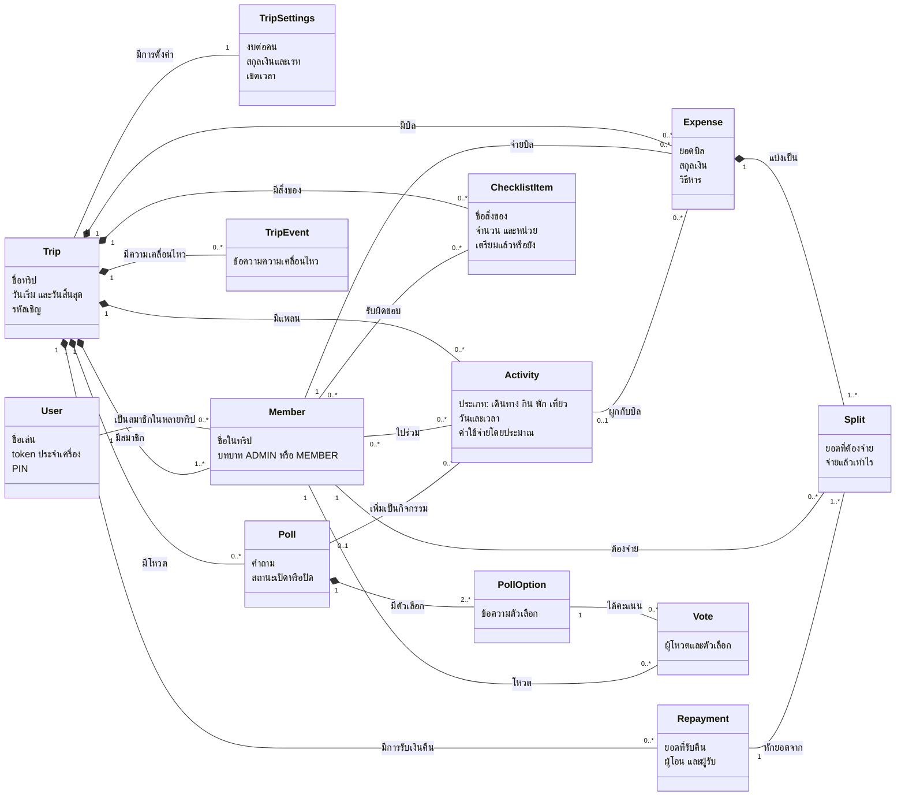

# Domain Model (Conceptual Class Diagram)

แสดงแนวคิดของระบบและความสัมพันธ์ระหว่างกัน โดยไม่ลงรายละเอียดการเขียนโค้ด (ฐานข้อมูลจริงอยู่ที่ [data-dictionary.md](../data-dictionary.md))

**กติกาสำคัญของโดเมน**
- ผลรวมส่วนแบ่ง (`Split`) ของบิลหนึ่งต้องเท่ายอดบิลพอดี
- หนี้ของสมาชิก = ส่วนแบ่งที่ต้องจ่าย − ยอดที่จ่ายคืนแล้ว ระบบรวบยอดเป็นรายการโอนน้อยที่สุด
- สมาชิกหนึ่งคนโหวตได้ 1 ตัวเลือกต่อ 1 โหวต
- คนเดียวกันอยู่ในทริปเดียวกันได้แถวเดียว (ชื่อซ้ำในทริปไม่ได้)
