# Class Diagram (ระบุตำแหน่ง Design Pattern)

แสดงคลาสหลักของโปรเจกต์ตามชั้น (Layered) และติดป้าย `<<...>>` บอกว่าคลาสไหนเป็นส่วนของ Pattern ใด
รายละเอียดเหตุผลและแผนภาพแยกของแต่ละ Pattern อยู่ที่ [design-patterns.md](../design-patterns.md)

ป้ายที่ใช้: Strategy, Factory, Builder, Observer (Subject / Event / Observer), Repository, Mapper, DTO

```mermaid
classDiagram
    direction TB

    namespace Presentation {
        class ExpenseController {
            <<Controller>>
        }
        class RepaymentEndpoints {
            <<Controller>>
        }
        class TripEventController {
            <<Controller>>
        }
        class AuthGuard {
            <<Security>>
        }
        class ApiErrorHandler {
            <<ControllerAdvice>>
        }
    }

    namespace ServiceLayer {
        class ExpenseService {
            <<interface>>
        }
        class ExpenseServiceImpl {
            <<Service + Subject>>
        }
        class RepaymentServiceImpl {
            <<Service + Subject>>
        }
        class TripAccessService {
            <<interface>>
        }
        class TripEventService {
            <<interface>>
        }
    }

    namespace StrategyAndFactory {
        class SplitStrategyFactory {
            <<Factory>>
        }
        class SplitStrategy {
            <<Strategy interface>>
        }
        class EqualSplitStrategy {
            <<Strategy>>
        }
        class CustomSplitStrategy {
            <<Strategy>>
        }
    }

    namespace ObserverPart {
        class ExpenseAddedEvent {
            <<Event>>
        }
        class RepaymentRecordedEvent {
            <<Event>>
        }
        class TripEventListener {
            <<Observer>>
        }
    }

    namespace DataAndMapping {
        class ExpenseRepo {
            <<Repository>>
        }
        class TripEventRepo {
            <<Repository>>
        }
        class Expense {
            <<Entity>>
        }
        class ExpenseMapper {
            <<Mapper>>
        }
        class ExpenseResponse {
            <<DTO>>
        }
        class ActivityResponse {
            <<DTO + Builder>>
        }
    }

    ExpenseController --> ExpenseService
    ExpenseController --> ExpenseMapper
    ExpenseController --> AuthGuard
    ExpenseController ..> ExpenseResponse
    AuthGuard --> TripAccessService
    ExpenseServiceImpl ..|> ExpenseService
    ExpenseServiceImpl --> ExpenseRepo
    ExpenseServiceImpl --> SplitStrategyFactory
    SplitStrategyFactory o-- SplitStrategy
    EqualSplitStrategy ..|> SplitStrategy
    CustomSplitStrategy ..|> SplitStrategy
    ExpenseServiceImpl ..> ExpenseAddedEvent : publish
    RepaymentServiceImpl ..> RepaymentRecordedEvent : publish
    TripEventListener ..> ExpenseAddedEvent : listen
    TripEventListener ..> RepaymentRecordedEvent : listen
    TripEventListener --> TripEventService
    TripEventService ..> TripEventRepo
    TripEventController --> TripEventService
    ExpenseRepo ..> Expense
    ExpenseMapper ..> Expense
    ExpenseMapper ..> ExpenseResponse
```

**ตำแหน่งของ Pattern ในแผนภาพ**

| Pattern | คลาสในแผนภาพ |
|---|---|
| Strategy | `SplitStrategy`, `EqualSplitStrategy`, `CustomSplitStrategy` |
| Factory | `SplitStrategyFactory` (Simple Factory) |
| Observer | Subject: `ExpenseServiceImpl`, `RepaymentServiceImpl` / Event: `ExpenseAddedEvent`, `RepaymentRecordedEvent` / Observer: `TripEventListener` |
| Builder | `ActivityResponse.Builder` (ใช้ใน `ActivityMapper`) |
| Singleton | ทุกคลาสที่เป็น Spring bean (`@Service`, `@Component`, `@RestController`) |
| Repository | `ExpenseRepo`, `TripEventRepo` และอีก 11 ตัวใน `repository/` |
| DTO + Mapper | `ExpenseResponse`, `ActivityResponse` + `ExpenseMapper` |
| Layered, MVC, DI | ตามกลุ่ม namespace Presentation / ServiceLayer / DataAndMapping และ Constructor Injection ทุกลูกศร |

> `RepaymentEndpoints` ในแผนภาพคือ endpoint รับเงินคืนใน `ExpenseController` (`/expenses/repay/...`) แยกวาดเพื่อให้เห็น `RepaymentServiceImpl` ที่ส่ง event
