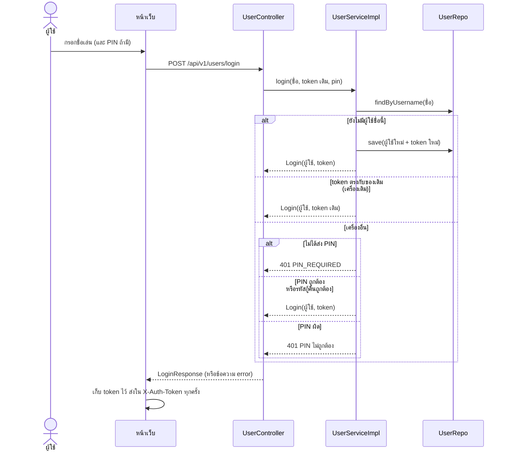
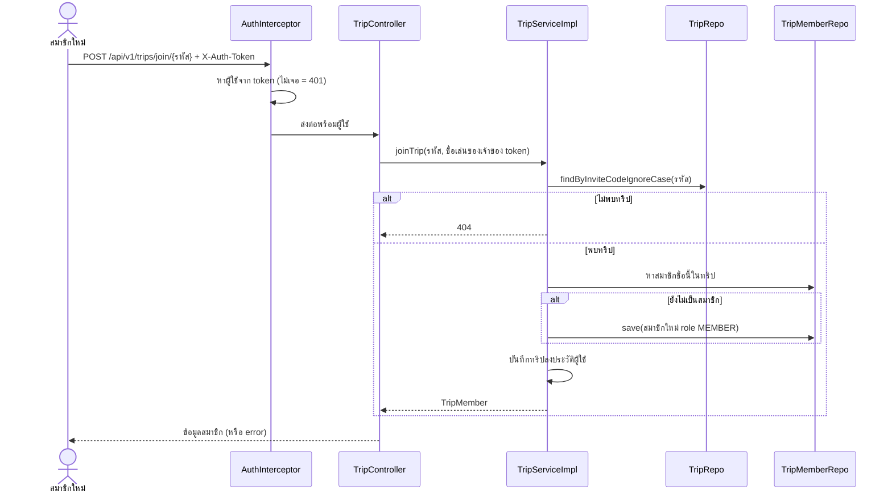
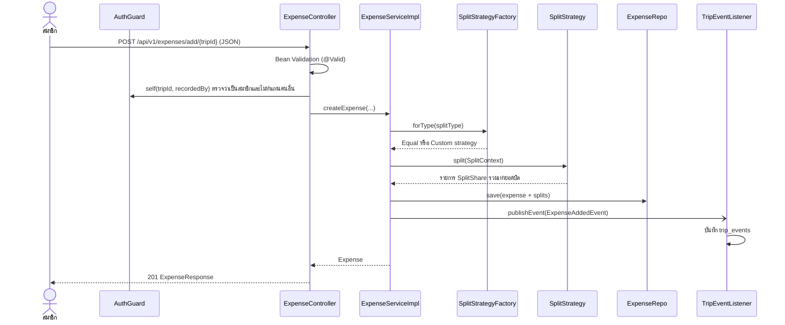
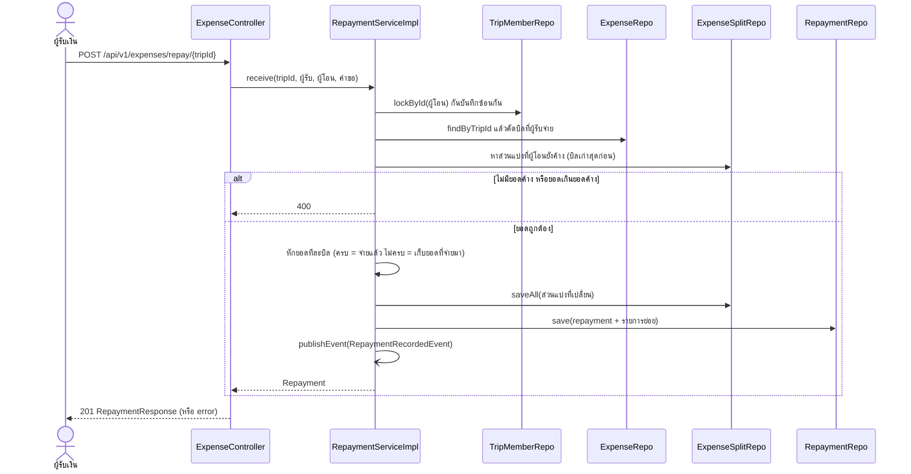
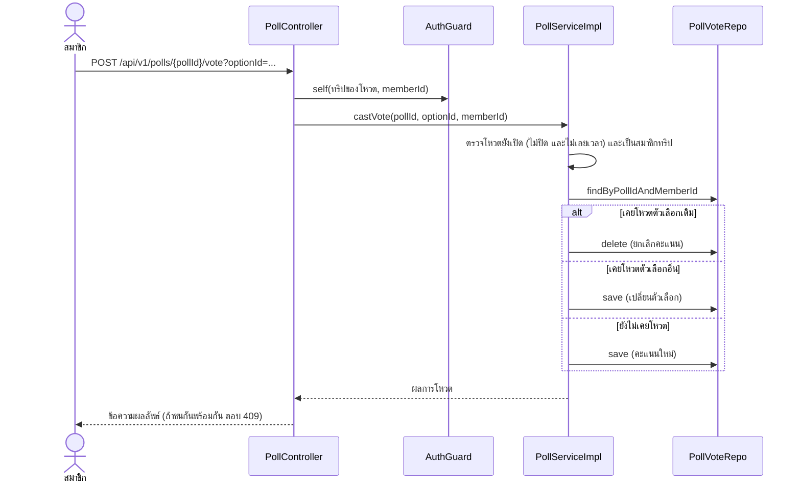

# Sequence Diagram

5 scenario หลัก ทุกลำดับเขียนตามโค้ดจริง (ชื่อคลาส/เมธอดตรงกับ `src/main/java/com/cp/party_trip/`)

## 1) เข้าสู่ระบบด้วยชื่อเล่น (รวมกรณีเครื่องอื่น)

## 2) เข้าร่วมทริปด้วยรหัสเชิญ

## 3) เพิ่มบิลและแบ่งส่วนแบ่ง (Strategy + Observer)

## 4) บันทึกการรับเงินคืน

## 5) ลงคะแนนโหวต

