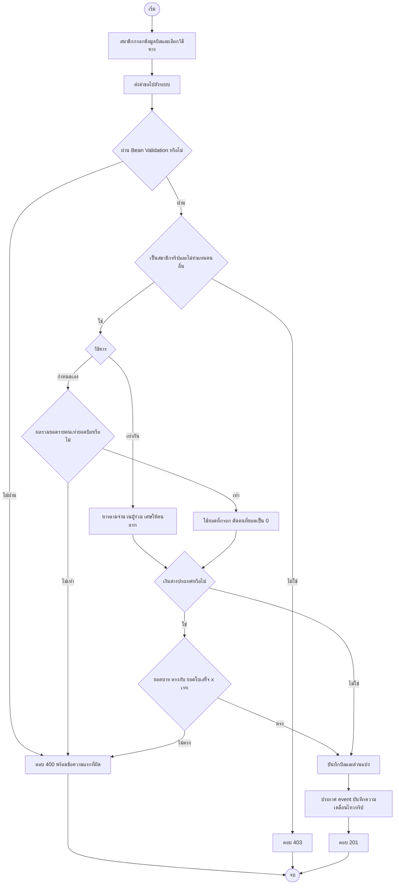
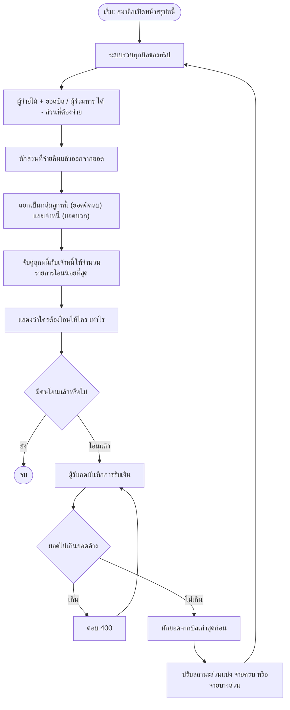

# Activity Diagram

## 1) กิจกรรมการบันทึกบิล

```mermaid
flowchart TD
    A(["เริ่ม"]) --> B["สมาชิกกรอกข้อมูลบิลและเลือกวิธีหาร"]
    B --> C["ส่งคำขอไปยังระบบ"]
    C --> D{"ผ่าน Bean Validation หรือไม่"}
    D -- ไม่ผ่าน --> E["ตอบ 400 พร้อมข้อความแรกที่ผิด"] --> Z(["จบ"])
    D -- ผ่าน --> F{"เป็นสมาชิกทริปและไม่ทำแทนคนอื่น"}
    F -- ไม่ใช่ --> G["ตอบ 403"] --> Z
    F -- ใช่ --> H{"วิธีหาร"}
    H -- เท่ากัน --> I["หารตามจำนวนผู้ร่วม เศษให้คนแรก"]
    H -- กำหนดเอง --> J{"ผลรวมยอดรายคนเท่ายอดบิลหรือไม่"}
    J -- ไม่เท่า --> E
    J -- เท่า --> K["ใช้ยอดที่กรอก ตัดคนที่ยอดเป็น 0"]
    I --> L{"เงินต่างประเทศหรือไม่"}
    K --> L
    L -- ใช่ --> M{"ยอดบาท ตรงกับ ยอดใบเสร็จ x เรท"}
    M -- ไม่ตรง --> E
    M -- ตรง --> N["บันทึกบิลและส่วนแบ่ง"]
    L -- ไม่ใช่ --> N
    N --> O["ประกาศ event บันทึกความเคลื่อนไหวทริป"]
    O --> P["ตอบ 201"] --> Z
```

## 2) กิจกรรมการสรุปหนี้และชำระคืน

```mermaid
flowchart TD
    A(["เริ่ม: สมาชิกเปิดหน้าสรุปหนี้"]) --> B["ระบบรวมทุกบิลของทริป"]
    B --> C["ผู้จ่ายได้ + ยอดบิล / ผู้ร่วมหาร ได้ - ส่วนที่ต้องจ่าย"]
    C --> D["หักส่วนที่จ่ายคืนแล้วออกจากยอด"]
    D --> E["แยกเป็นกลุ่มลูกหนี้ (ยอดติดลบ) และเจ้าหนี้ (ยอดบวก)"]
    E --> F["จับคู่ลูกหนี้กับเจ้าหนี้ให้จำนวนรายการโอนน้อยที่สุด"]
    F --> G["แสดงว่าใครต้องโอนให้ใคร เท่าไร"]
    G --> H{"มีคนโอนแล้วหรือไม่"}
    H -- ยัง --> Z(["จบ"])
    H -- โอนแล้ว --> I["ผู้รับกดบันทึกการรับเงิน"]
    I --> J{"ยอดไม่เกินยอดค้าง"}
    J -- เกิน --> K["ตอบ 400"] --> I
    J -- ไม่เกิน --> L["หักยอดจากบิลเก่าสุดก่อน"]
    L --> M["ปรับสถานะส่วนแบ่ง จ่ายครบ หรือจ่ายบางส่วน"]
    M --> B
```
