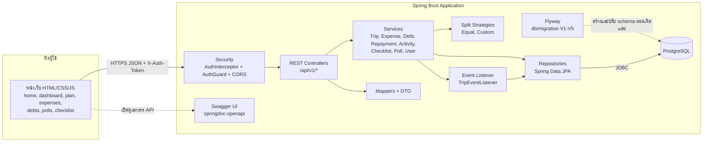
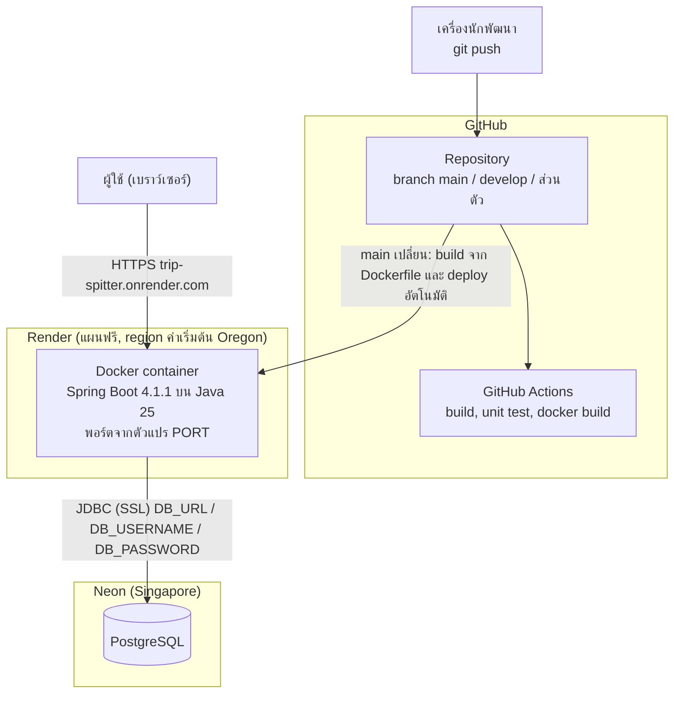

# Component Diagram และ Deployment Diagram

## Component Diagram

## Deployment Diagram

**หมายเหตุ**
- ตัวแปรลับของฐานข้อมูลตั้งในหน้า Environment ของ Render ไม่เก็บใน Git
- แผนฟรีของ Render ให้แอป "หลับ" เมื่อไม่มีคนใช้นาน ~15 นาที และจะตื่นเมื่อมี request (ช้าครั้งแรก 30-60 วินาที)
- แอปอยู่ region ค่าเริ่มต้นของ Render (Oregon) ส่วนฐานข้อมูลอยู่ Singapore เป็นความต่างของ region ที่รู้และยอมรับไว้ (Render เปลี่ยน region ของ service เดิมไม่ได้)
- รันบนเครื่องตัวเองได้ด้วย `docker compose up --build` (app + PostgreSQL ใน container) ดู README
