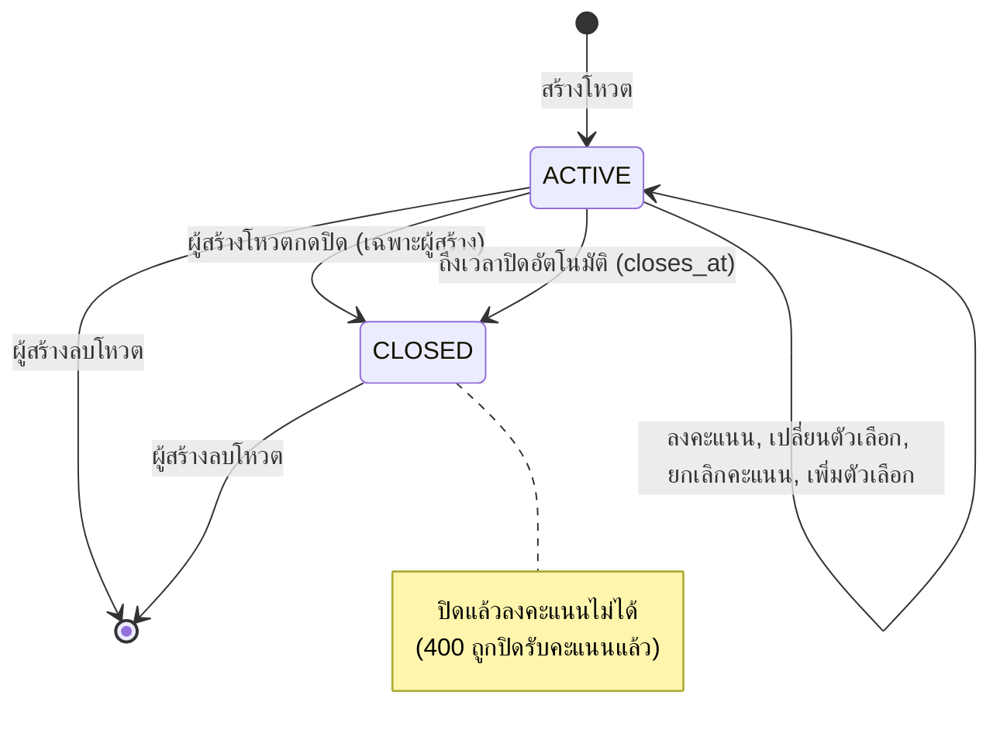
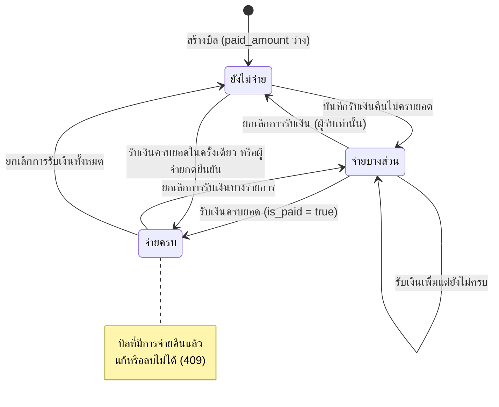
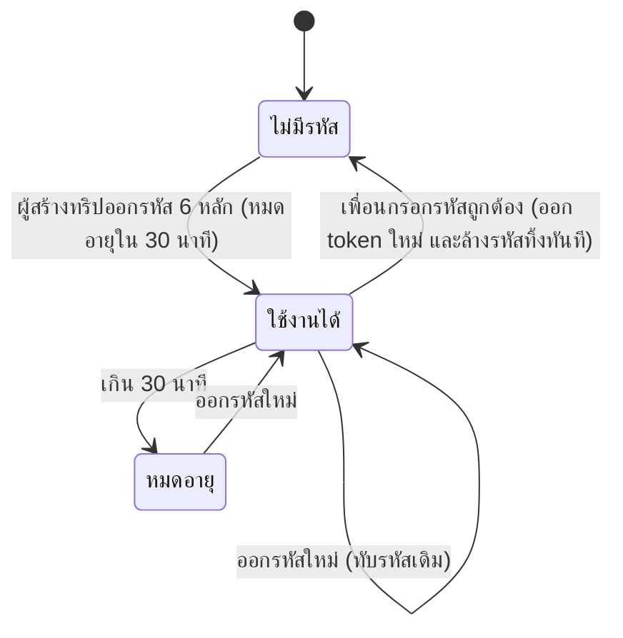

# State Diagram

Entity ที่มีสถานะในระบบ 3 ตัว: **โหวต (Poll)**, **ส่วนแบ่งของบิล (ExpenseSplit)** และ **รหัสกู้คืน (Recovery code)**

## 1) โหวต (`polls.status`)

## 2) ส่วนแบ่งของบิล (`expense_splits`)

สถานะคำนวณจากฟิลด์ `is_paid` และ `paid_amount` ของแต่ละส่วนแบ่ง

## 3) รหัสกู้คืนของผู้ใช้ (`users.recovery_hash`, `recovery_expires_at`)

