# คู่มือการใช้งาน Trip Splitter

[← กลับไป README](../README.md)

เปิดใช้งานที่ https://trip-spitter.onrender.com/home.html ไม่ต้องสมัครสมาชิกด้วยอีเมล ใช้แค่ "ชื่อเล่น" (ตั้ง PIN เพิ่มได้เพื่อเข้าชื่อเดิมจากเครื่องอื่น)
ภาพด้านล่างเป็นหน้าจอจริงของระบบ

| ขั้นตอน | ทำอะไร | หน้า |
|---|---|---|
| 1 | เข้าระบบด้วยชื่อเล่น แล้วสร้างห้องทริปหรือเข้าร่วมด้วยรหัสเชิญ | [หน้าแรก](#1-หน้าแรก-เข้าระบบ-สร้างห้อง-เข้าร่วมห้อง) |
| 2 | ดูภาพรวมทริปและส่งรหัสเชิญให้เพื่อน | [ภาพรวมทริป](#2-ภาพรวมทริป) |
| 3 | วางแพลนเที่ยวรายวัน | [แพลนเที่ยว](#3-แพลนเที่ยว) |
| 4 | บันทึกค่าใช้จ่ายและเลือกวิธีหาร | [ค่าใช้จ่าย](#4-ค่าใช้จ่าย) |
| 5 | ดูว่าใครต้องคืนใคร แล้วบันทึกการรับเงิน | [สรุปยอดคืน](#5-สรุปยอดคืน) |
| 6 | ส่งสรุปทริปเข้ากลุ่มแชต | [แชร์สรุปทริป](#6-แชร์สรุปทริป) |
| 7 | ให้เพื่อนโหวตตัดสินใจ | [โหวต](#7-โหวต) |
| 8 | จดของที่ต้องเตรียมและแบ่งคนรับผิดชอบ | [เช็คลิสต์](#8-เช็คลิสต์) |

## 1. หน้าแรก: เข้าระบบ สร้างห้อง เข้าร่วมห้อง

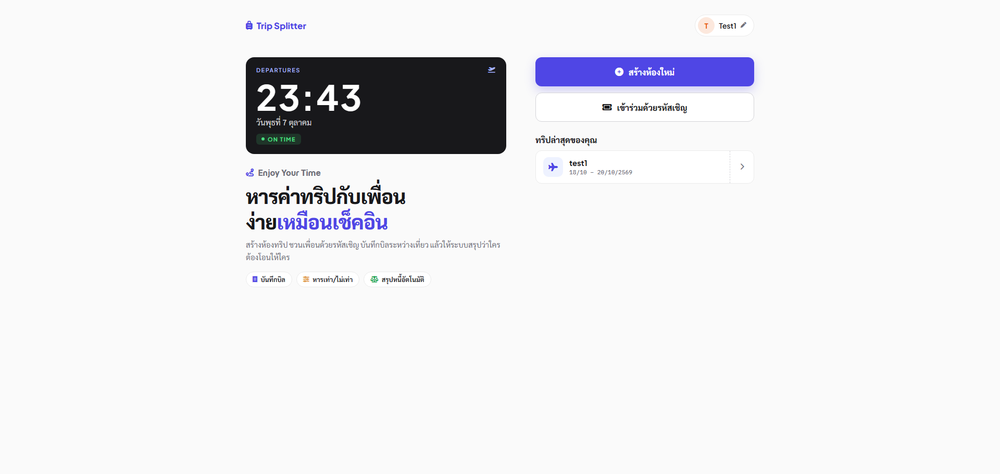

1. เข้าครั้งแรกระบบตั้งชื่อชั่วคราวให้ (เช่น TripGuest_123) กดที่ชื่อมุมขวาบนเพื่อเปลี่ยนเป็นชื่อเล่นของคุณ (ชื่อนี้เพื่อนในทริปจะเห็น)
2. กด **สร้างห้องใหม่** หรือ **เข้าร่วมด้วยรหัสเชิญ**
3. ทริปที่เคยเข้าจะแสดงในรายการ **ทริปล่าสุดของคุณ** กดเพื่อกลับเข้าทริปได้ทันที

**สร้างห้องใหม่:** ใส่ชื่อห้อง วันออกเดินทาง และวันกลับ แล้วกด **ยืนยันสร้างห้อง** ระบบจะสร้างรหัสเชิญ 6 หลักให้

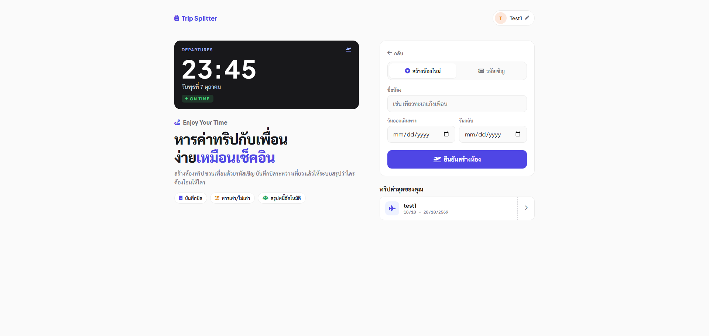

**เข้าร่วมด้วยรหัสเชิญ:** ใส่รหัส 6 หลักที่เพื่อนส่งให้ แล้วกด **เข้าร่วมห้องทริป** เพื่อนในห้องจะเห็นคุณด้วยชื่อเล่นของคุณ

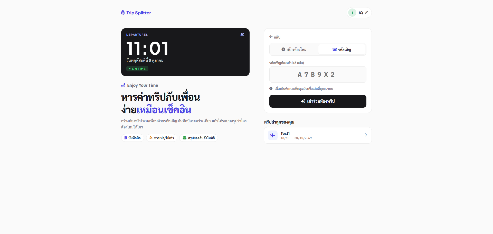

**เปลี่ยนชื่อเล่น / ตั้ง PIN:** กดที่ชื่อมุมขวาบน ใส่ชื่อใหม่ และตั้ง PIN 4-6 หลักถ้าต้องการเข้าชื่อนี้จากเครื่องอื่น ชื่อใหม่จะตามไปทุกทริปและทุกบิลเดิมโดยอัตโนมัติ

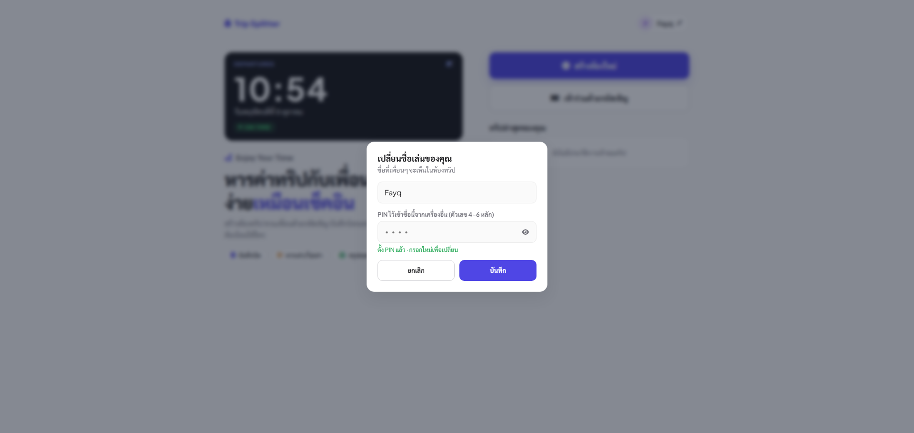

> ลืม PIN หรือเปลี่ยนเครื่อง: ให้คนสร้างทริปออก **รหัสกู้คืน** ให้ (ใช้ได้ 30 นาที) แล้วใส่รหัสนั้นในช่อง PIN

## 2. ภาพรวมทริป

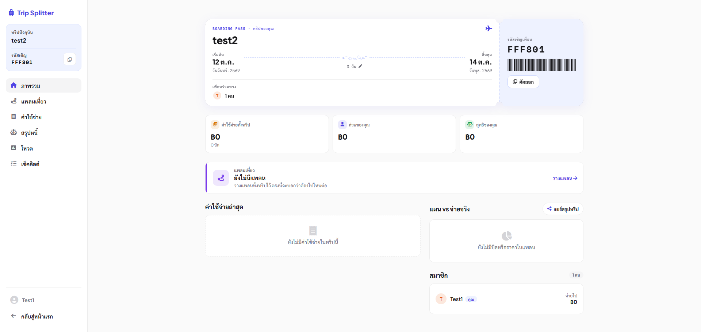

- บัตร **Boarding Pass** แสดงชื่อทริป วันเริ่ม-สิ้นสุด และเพื่อนร่วมทาง กด **คัดลอก** เพื่อส่งรหัสเชิญให้เพื่อน
- การ์ดสรุปแสดงค่าใช้จ่ายทั้งทริป ส่วนของคุณ และยอดสุทธิของคุณ
- ด้านล่างเป็นแพลนที่ใกล้ถึง ค่าใช้จ่ายล่าสุด เปรียบเทียบแผนกับที่จ่ายจริง และรายชื่อสมาชิก
- แถบด้านซ้ายใช้สลับไปหน้าต่างๆ ของทริป
- ถ้ายังไม่ตั้ง PIN จะมีแถบเตือน **ตั้ง PIN กันลืม** ที่ด้านบน กดตั้งหรือเลือก "ไว้ทีหลัง" ก็ได้

## 3. แพลนเที่ยว

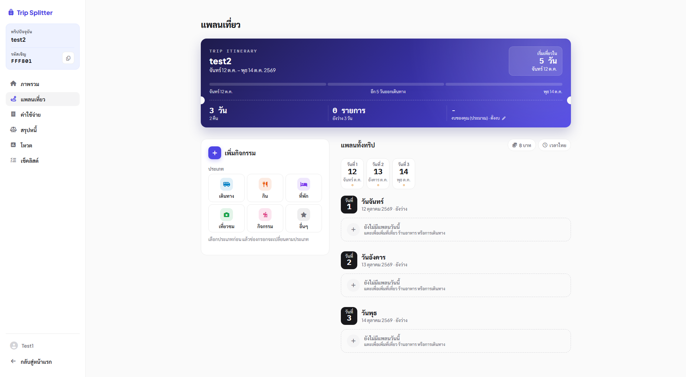

1. เลือกประเภทกิจกรรม: เดินทาง, กิน, ที่พัก, เที่ยวชม, กิจกรรม หรืออื่นๆ
2. ถ้าเป็นการเดินทาง ให้เลือกวิธี (รถส่วนตัว รถตู้ รถไฟ เครื่องบิน เรือ ฯลฯ) และกรอกต้นทาง ปลายทาง เวลาออก เวลาถึง
3. เลือกวันที่ทำกิจกรรม เลือกคนที่ไปด้วย ใส่ค่าใช้จ่ายต่อคน (ประมาณการ) และโน้ต
4. กด **เพิ่มลงแพลน** กิจกรรมจะขึ้นในวันที่เลือกทางด้านขวา

แถบด้านบนแสดงนับถอยหลังวันเดินทาง จำนวนรายการ และงบรวมของคุณ

## 4. ค่าใช้จ่าย

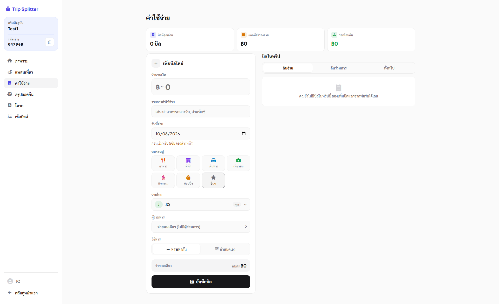

1. ใส่จำนวนเงิน (เลือกสกุลเงินได้) และชื่อรายการ เช่น "ค่าอาหารกลางวัน"
2. เลือกวันที่จ่ายและหมวดหมู่ (อาหาร ที่พัก เดินทาง เที่ยวชม กิจกรรม ช้อปปิ้ง อื่นๆ)
3. เลือก **จ่ายโดย** (ใครสำรองจ่าย) และ **ผู้ร่วมหาร** (ใครต้องช่วยจ่าย)
4. เลือก **วิธีหาร**
   - **หารเท่ากัน:** ระบบหารให้เท่ากัน เศษสตางค์ปัดให้ลงตัว
   - **กำหนดเอง:** ระบุยอดของแต่ละคนเอง
5. กด **บันทึกบิล**

บิลที่บันทึกแล้วดูได้ 3 มุมมอง: **ฉันจ่าย**, **ฉันร่วมหาร** และ **ทั้งทริป** แก้ไขหรือลบได้เฉพาะคนที่จ่ายหรือคนที่บันทึกบิลนั้น และทำไม่ได้ถ้ามีเพื่อนจ่ายคืนบิลนั้นแล้ว

## 5. สรุปยอดคืน

หน้านี้บอกว่า "ฉันต้องจ่ายใคร" และ "ใครต้องคืนฉัน" ตัวเลขด้านบนคือ **ต้องจ่าย**, **รอรับคืน** และ **สุทธิ**

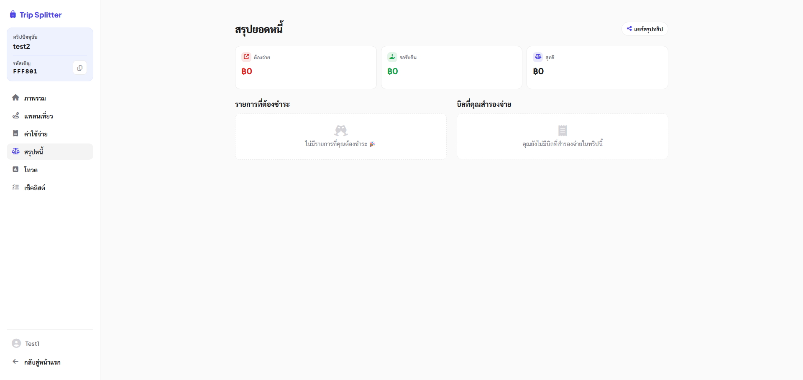

- ฝั่งซ้าย **รายการที่ต้องชำระ:** แสดงคนที่คุณต้องโอนให้ พอโอนแล้วให้แจ้งเจ้าของบิลกดยืนยัน
- ฝั่งขวา **บิลที่คุณสำรองจ่าย:** แสดงเพื่อนแต่ละคนที่ค้างคุณ แต่ละบรรทัดบอก "เหลือ ... จาก ..." (ยอดที่เหลือ จากยอดที่เขาต้องจ่ายเต็ม)

**ยืนยันรับเงินทีละบิล:** กด **ยืนยันรับเงิน** ที่บิลนั้น แล้วยืนยันในกล่องที่ขึ้นมา

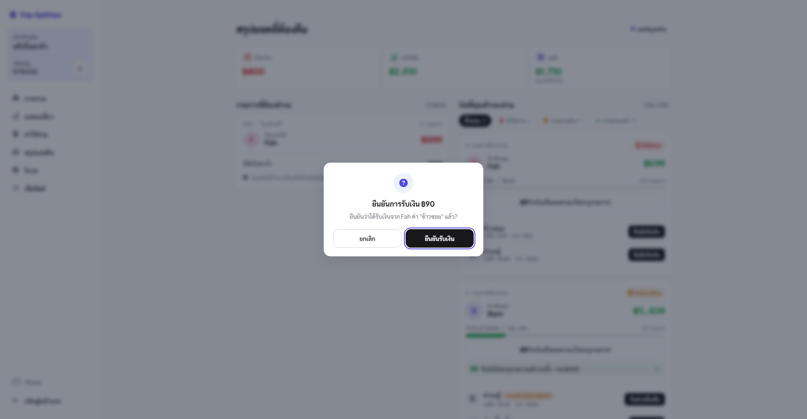

**รับเงินเป็นยอดรวม (ไม่ระบุรายการ):** ใช้เมื่อเพื่อนโอนมาก้อนเดียวหลายบิล

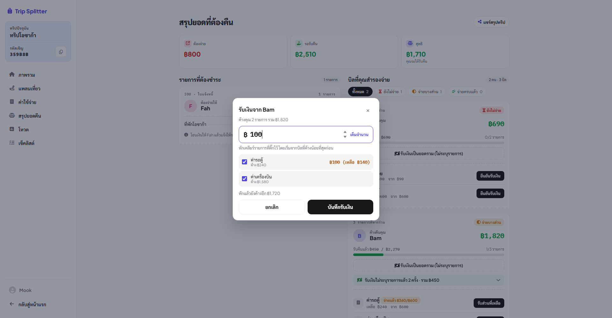

1. กด **รับเงินเป็นยอดรวม** ที่การ์ดของเพื่อน ใส่ยอดที่ได้รับ (หรือกด **เต็มจำนวน**)
2. ติ๊กเลือกบิลที่จะหัก ระบบจะหักจาก **บิลที่ค้างน้อยที่สุดก่อน** เพื่อปิดบิลเล็กๆ ให้จบ ไม่ค้างเป็น "จ่ายบางส่วน" นาน ตัวอย่างการหักแสดงทางขวาของแต่ละบรรทัดทันที
3. กด **บันทึกรับเงิน**

รายการรับเงินยอดรวมถูกพับเก็บไว้ในแถบเดียว กดเพื่อขยายดูว่าแต่ละครั้งหักจากบิลไหนเท่าไร ถ้ากรอกผิดให้กดไอคอนถังขยะ (ยกเลิกได้เฉพาะรายการล่าสุดของเพื่อนคนนั้น และต้องเป็นคนที่รับเงิน) ยอดที่หักจะกลับไปค้างเหมือนเดิม

## 6. แชร์สรุปทริป

กด **แชร์สรุปทริป** (ในหน้าภาพรวมหรือสรุปยอดคืน) ระบบสร้างข้อความสรุปให้ส่งเข้ากลุ่มแชต

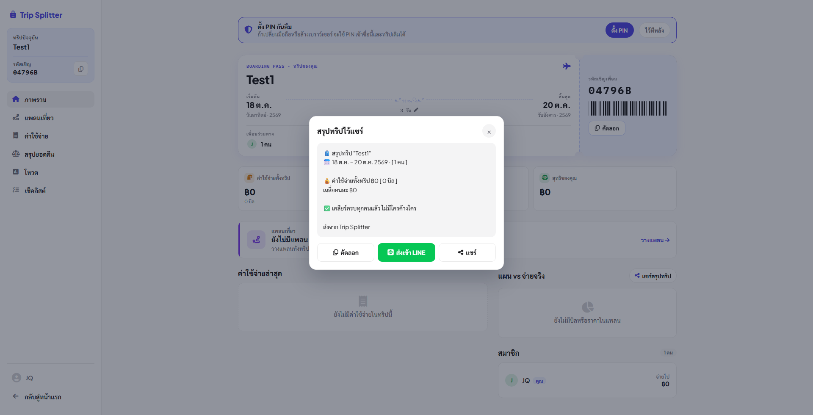

ในข้อความมี ค่าใช้จ่ายทั้งทริปและเฉลี่ยต่อคน ใครต้องคืนใคร เท่าไร ค่าใช้จ่ายของแต่ละคน (ทั้งหมด / เฉพาะตัวเอง) และค่าใช้จ่ายตามหมวด
ปุ่ม **คัดลอก** คัดลอกข้อความ **ส่งเข้า LINE** เปิด LINE พร้อมข้อความ และ **แชร์** ใช้เมนูแชร์ของเครื่อง (มือถือ)

## 7. โหวต

1. ใส่คำถาม (กดหัวข้อตัวอย่างเพื่อใช้ได้เลย เช่น "มื้อนี้กินอะไรดี?")
2. ใส่ตัวเลือกอย่างน้อย 2 ข้อ (สูงสุด 10 ข้อ กด **เพิ่มตัวเลือก**)
3. เลือกระยะเวลาเปิดโหวต: ไม่จำกัด, 30 นาที, 1 ชั่วโมง, 3 ชั่วโมง, 1 วัน หรือกำหนดเอง
4. กด **เปิดโหวต** เพื่อนกดเลือกตัวเลือกได้ทันที กดตัวเลือกเดิมซ้ำเพื่อยกเลิกคะแนน หรือกดตัวเลือกอื่นเพื่อเปลี่ยน คนสร้างโหวตปิดโหวตได้เอง

## 8. เช็คลิสต์

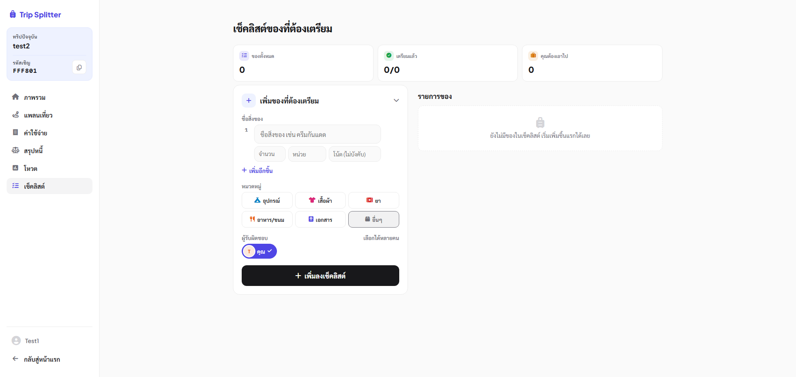

1. ใส่ชื่อสิ่งของ (เพิ่มหลายชิ้นพร้อมกันได้ด้วย **เพิ่มอีกชิ้น**) จำนวน หน่วย และโน้ต
2. เลือกหมวดหมู่ (อุปกรณ์, เสื้อผ้า, ยา, อาหาร/ขนม, เอกสาร, อื่นๆ)
3. เลือก **ผู้รับผิดชอบ** ได้หลายคน
4. กด **เพิ่มลงเช็คลิสต์** เมื่อเตรียมของแล้วให้ติ๊กในรายการ ตัวนับด้านบนจะแสดงว่าเตรียมแล้วกี่ชิ้น และมีของที่คุณต้องเอาไปกี่ชิ้น
